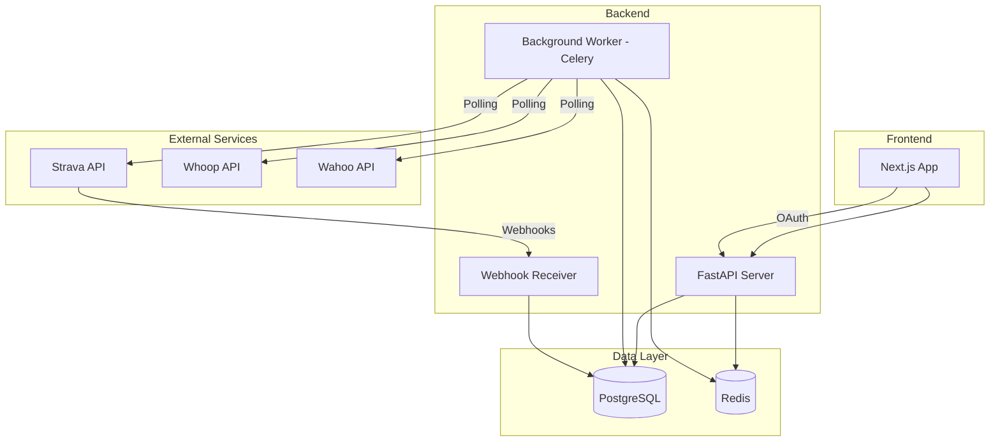
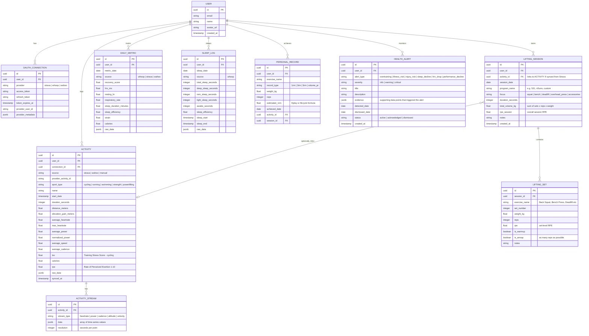

# Fitness Tracker — Architecture Plan

## 1. Project Overview

A personal fitness tracker for **powerlifting** and **cycling** that aggregates data from **Strava**, **Whoop**, and **Wahoo** into a unified dashboard with trend analysis and correlation insights. Initially single-user with the ability to invite a small number of friends. Training planning features will follow in a later phase.

### Primary Sports Context

- **Cycling** — endurance sport with rich time-series data: power, cadence, HR zones, speed, elevation. Well-served by Strava and Wahoo.
- **Powerlifting** — strength sport with set-based data: exercise, sets × reps × weight, RPE, rest periods. Strava tracks these as generic "workouts" with limited detail. The app needs to augment synced data with structured lifting session logging.

### Key Decisions Summary

| Decision | Choice |
|----------|--------|
| Target users | Self + small friend group |
| Primary sports | Powerlifting + Cycling |
| Integrations | Strava, Whoop, Wahoo |
| Core features | Dashboard, data aggregation, insights |
| Backend | Python / FastAPI |
| Database | PostgreSQL |
| Frontend | Next.js (React) |
| Auth | OAuth 2.0 — Google + GitHub |
| Data sync | Webhooks (Strava) + scheduled polling (Whoop, Wahoo) |
| Deployment | Local dev → DigitalOcean VPS via Docker |

---

## 2. System Architecture



---

## 3. Tech Stack Detail

### Backend — Python / FastAPI

- **FastAPI** for the REST API — async-first, auto-generates OpenAPI docs, excellent for webhook endpoints
- **Celery** + **Redis** for background task scheduling (polling integrations, data processing)
- **SQLAlchemy 2.0** (async) as the ORM
- **Alembic** for database migrations
- **httpx** for async HTTP calls to external APIs
- **Pydantic v2** for data validation and serialization

### Frontend — Next.js

- **Next.js 14+** (App Router) — SSR for dashboard pages, API routes for BFF pattern if needed
- **Tailwind CSS** for styling
- **Recharts** or **Tremor** for data visualization (charts, trends)
- **NextAuth.js** for OAuth session management
- **TanStack Query** for data fetching and caching

### Database — PostgreSQL

- Single PostgreSQL instance with well-normalized schema
- **TimescaleDB extension** (optional, phase 2) — if time-series query performance becomes a concern for high-frequency sensor data

### Infrastructure

- **Docker Compose** for local development (app, db, redis, worker, beat scheduler)
- **DigitalOcean Droplet** for deployment — Docker Compose or Dokku for simplicity
- **Caddy** or **Nginx** as reverse proxy with automatic TLS via Let's Encrypt

---

## 4. Data Model (Core Entities)



### Training Calendar

The calendar is **autopopulated** — no manual planning required. It aggregates data from all sources into a daily view:

- **Each day shows**: activities completed (cycling rides, Wahoo indoor sessions), lifting sessions, Whoop recovery/sleep/strain scores
- **Color coding**: green (good recovery + training), yellow (moderate), red (poor recovery or missed training), grey (rest day)
- **Views**: weekly and monthly with drill-down to individual day detail
- **TSS and volume overlays**: cycling TSS and lifting volume plotted alongside recovery trends

### Anomaly / Health Alert Detection

A background analysis job runs daily after all syncs complete. It applies rule-based and statistical anomaly detection across key metrics:

| Alert Type | Trigger Condition | Example |
|------------|-------------------|---------|
| `overtraining` | Sustained high strain + declining recovery over 5+ days | Whoop strain > 15 for 5 days while recovery drops below 50% |
| `illness_risk` | Sudden HRV drop + elevated resting HR + poor sleep | HRV drops > 20% below 7-day average, resting HR up > 10% |
| `injury_risk` | Sudden performance decline or asymmetry in lifting data | Squat volume drops > 30% or power output drops significantly |
| `sleep_decline` | Sleep duration or efficiency trending down over 7+ days | Average sleep < 6h for a week, or efficiency dropping steadily |
| `hrv_drop` | HRV trending significantly below personal baseline | HRV > 2 standard deviations below 30-day rolling average |
| `performance_decline` | Cycling power or lifting numbers trending down | FTP estimate declining, or key lift estimated 1RM dropping over 4+ weeks |

**Detection approach**: Use rolling statistical windows (7-day, 14-day, 30-day averages) and flag when current values deviate significantly. Alerts include the supporting evidence data so you can see exactly what triggered them.

---

## 5. Integration Details

### 5.1 Strava

| Aspect | Detail |
|--------|--------|
| Auth | OAuth 2.0 — Strava issues access + refresh tokens |
| Webhooks | **Yes** — Strava supports push notifications for new/updated activities |
| Data pulled | Athlete profile, activities (all types), activity streams (HR, power, cadence, altitude, velocity), gear, segments, laps, zones |
| Rate limits | 100 requests/15 min, 1000/day — use webhooks to minimize polling |
| Sync strategy | Webhook for new activities → fetch full detail + streams on webhook event. Nightly reconciliation poll to catch anything missed |

### 5.2 Whoop

| Aspect | Detail |
|--------|--------|
| Auth | OAuth 2.0 — Whoop API v1 |
| Webhooks | **No** — must poll |
| Data pulled | Recovery (score, HRV, resting HR, respiratory rate), sleep (cycles, stages, quality), strain (day strain score, heart rate zones), workouts, body measurements |
| Rate limits | 100 requests/min — generous for polling |
| Sync strategy | Poll every 30 min for recovery/sleep updates. Daily full sync for historical backfill |

### 5.3 Wahoo

| Aspect | Detail |
|--------|--------|
| Auth | OAuth 2.0 — Wahoo Cloud API |
| Webhooks | **No** — must poll |
| Data pulled | Workouts (structured workout data, power, HR, cadence, speed), workout files (FIT files), user profile, equipment |
| Rate limits | Not publicly documented — conservative polling recommended |
| Sync strategy | Poll every 30 min for new workouts. Download FIT files for detailed stream data |

---

## 6. API Design (FastAPI)

### Endpoint Groups

```
/api/v1/auth/
    GET    /oauth/{provider}/authorize     # Initiate OAuth flow
    GET    /oauth/{provider}/callback      # OAuth callback
    POST   /logout
    GET    /me                              # Current user profile

/api/v1/connections/
    GET    /                                # List connected services
    DELETE /{connection_id}                 # Disconnect a service
    POST   /{connection_id}/sync           # Trigger manual sync

/api/v1/activities/
    GET    /                                # List activities (filterable by source, sport_type, date range)
    GET    /{activity_id}                   # Activity detail with streams
    GET    /{activity_id}/streams           # Time-series data for an activity

/api/v1/lifting/
    GET    /sessions                        # List lifting sessions (filterable by date, focus, program)
    POST   /sessions                        # Create a new lifting session manually
    GET    /sessions/{session_id}           # Session detail with all sets
    PUT    /sessions/{session_id}           # Update session
    DELETE /sessions/{session_id}           # Delete session
    POST   /sessions/{session_id}/sets      # Add a set to a session
    PUT    /sessions/{session_id}/sets/{set_id}  # Update a set
    DELETE /sessions/{session_id}/sets/{set_id}  # Delete a set
    GET    /personal-records                # List PRs by exercise
    GET    /volume                          # Volume trends over time (total volume, volume per muscle group)

/api/v1/calendar/
    GET    /                                # Autopopulated calendar — merged view of all training days
    GET    /{date}                          # Full day detail (activities, lifting, recovery, sleep for that date)
    GET    /week/{start_date}              # Weekly view with daily summaries
    GET    /month/{year}/{month}           # Monthly view

/api/v1/alerts/
    GET    /                                # List active alerts and warnings
    GET    /history                         # Historical alerts

/api/v1/metrics/
    GET    /daily                           # Daily metrics (recovery, sleep, strain)
    GET    /trends                          # Aggregated trends (weekly, monthly)
    GET    /correlations                    # Cross-service correlation data

/api/v1/sleep/
    GET    /                                # Sleep logs with filtering

/api/v1/dashboard/
    GET    /summary                         # Dashboard overview data
    GET    /weekly-report                   # Weekly summary across all sources

/api/v1/webhooks/
    POST   /strava                          # Strava webhook endpoint (challenge + events)
```

### Lifting Data Strategy

Powerlifting data enters the system through two paths:

1. **Manual entry** — User logs lifting sessions directly in the app with full set/rep/weight/RPE detail. This is the primary path since Strava/Wahoo don't capture structured strength data well.
2. **Strava sync** — If the user logs a strength workout on Strava (or via a Garmin/Apple Watch), it syncs as a basic `ACTIVITY` with `sport_type=strength`. The user can optionally link it to a detailed `LIFTING_SESSION` for richer data.

The lifting module is designed to be the primary interface for strength training, with the cycling/Strava/Wahoo data flowing in automatically.

### Chart / Graph Abstraction Layer

A reusable backend service that generates **standardized chart-ready data** so new visualizations can be added with minimal code. The frontend renders these without needing to understand the underlying query logic.

**Design pattern** — a `ChartService` with pre-built chart generators:

```python
# backend/app/services/charts.py

class ChartService:
    """Generates standardized chart data structures for the frontend."""

    def __init__(self, db: AsyncSession, user_id: UUID):
        self.db = db
        self.user_id = user_id

    # --- Cycling Charts ---
    async def power_curve(self, period_days: int = 90) -> ChartData:
        """Best power outputs at various durations (5s, 1min, 5min, 20min, 60min)."""

    async def ftp_over_time(self) -> ChartData:
        """FTP estimate progression over time."""

    async def weekly_tss(self, weeks: int = 12) -> ChartData:
        """Weekly Training Stress Score bar chart."""

    async def power_zones_distribution(self, period_days: int = 30) -> ChartData:
        """Time spent in each power zone — pie/donut chart."""

    async def cycling_volume(self, weeks: int = 12) -> ChartData:
        """Weekly hours and distance trend."""

    # --- Lifting Charts ---
    async def estimated_1rm_history(self, exercise: str) -> ChartData:
        """Estimated 1RM over time for a given exercise — Brzycki formula."""

    async def weekly_volume(self, weeks: int = 12) -> ChartData:
        """Total lifting volume kg per week."""

    async def volume_by_exercise(self, period_days: int = 30) -> ChartData:
        """Volume breakdown by exercise — bar chart."""

    async def training_frequency(self, weeks: int = 12) -> ChartData:
        """Sessions per week over time."""

    # --- Recovery / Health Charts ---
    async def hrv_trend(self, days: int = 90) -> ChartData:
        """HRV over time with rolling average overlay."""

    async def recovery_vs_strain(self, days: int = 30) -> ChartData:
        """Scatter plot of Whoop recovery vs. day strain."""

    async def sleep_quality_trend(self, days: int = 30) -> ChartData:
        """Sleep duration and efficiency over time — dual axis."""

    async def recovery_vs_performance(self, days: int = 60) -> ChartData:
        """Whoop recovery score vs. next-day cycling power or lifting volume."""

    # --- Combined / Custom ---
    async def custom_timeseries(
        self,
        metrics: list[str],
        period_days: int = 30,
        aggregation: str = "daily"
    ) -> ChartData:
        """Flexible multi-metric timeseries — pass metric names, get overlaid chart data."""
```

**Standardized response format** — every chart returns a consistent [`ChartData`](plans/fitness-tracker-architecture.md) structure:

```python
@dataclass
class ChartSeries:
    name: str                    # Series label e.g. "Estimated 1RM"
    data: list[dict]             # [{x: "2024-01-15", y: 140.0}, ...]
    color: str | None = None     # Optional hex color hint
    unit: str | None = None      # "kg", "watts", "bpm", "minutes"

@dataclass
class ChartData:
    chart_type: str              # "line", "bar", "scatter", "area", "pie"
    title: str
    x_label: str                 # "Date", "Week", "Exercise"
    y_label: str                 # "Weight kg", "Power watts", "HRV ms"
    series: list[ChartSeries]
    annotations: list[dict] | None = None  # Optional markers e.g. PR dates
```

The frontend has a single generic [`<Chart data={chartData} />`](plans/fitness-tracker-architecture.md) component that inspects `chart_type` and renders the appropriate Recharts/Tremor visualization. Adding a new chart = one async method in `ChartService` + one API endpoint. No frontend chart code needed.

**API endpoint**:
```
/api/v1/charts/
    GET    /{chart_name}?period=90&exercise=squat    # Generic chart endpoint
```

---

## 7. Project Structure

```
fitness-tracker/
├── docker-compose.yml
├── .env.example
├── README.md
│
├── backend/
│   ├── pyproject.toml              # Poetry/PDM dependencies
│   ├── alembic.ini
│   ├── alembic/
│   │   └── versions/
│   ├── app/
│   │   ├── __init__.py
│   │   ├── main.py                 # FastAPI app entrypoint
│   │   ├── config.py               # Settings via pydantic-settings
│   │   ├── database.py             # SQLAlchemy engine + session
│   │   ├── models/                 # SQLAlchemy models
│   │   │   ├── user.py
│   │   │   ├── connection.py
│   │   │   ├── activity.py
│   │   │   ├── lifting.py          # LiftingSession + LiftingSet + PersonalRecord
│   │   │   ├── daily_metric.py
│   │   │   ├── sleep.py
│   │   │   └── health_alert.py     # HealthAlert model
│   │   ├── schemas/                # Pydantic request/response schemas
│   │   │   └── charts.py           # ChartData + ChartSeries response schemas
│   │   ├── api/                    # Route handlers
│   │   │   ├── auth.py
│   │   │   ├── connections.py
│   │   │   ├── activities.py
│   │   │   ├── lifting.py          # Lifting session CRUD + PRs + volume
│   │   │   ├── calendar.py         # Autopopulated training calendar
│   │   │   ├── alerts.py           # Health alerts endpoint
│   │   │   ├── charts.py           # Generic chart data endpoint
│   │   │   ├── metrics.py
│   │   │   ├── sleep.py
│   │   │   ├── dashboard.py
│   │   │   └── webhooks.py
│   │   ├── services/               # Business logic
│   │   │   ├── strava.py
│   │   │   ├── whoop.py
│   │   │   ├── wahoo.py
│   │   │   ├── lifting.py          # Lifting session logic, PR detection, volume calc
│   │   │   ├── charts.py           # ChartService — reusable chart data generators
│   │   │   ├── calendar.py         # Calendar aggregation logic
│   │   │   ├── health_alerts.py    # Anomaly detection engine
│   │   │   └── insights.py         # Cross-service correlation logic
│   │   ├── integrations/           # API clients for external services
│   │   │   ├── strava_client.py
│   │   │   ├── whoop_client.py
│   │   │   └── wahoo_client.py
│   │   └── tasks/                  # Celery background tasks
│   │       ├── sync_strava.py
│   │       ├── sync_whoop.py
│   │       ├── sync_wahoo.py
│   │       ├── detect_anomalies.py # Daily anomaly detection job
│   │       └── scheduler.py        # Celery Beat schedule config
│   └── tests/
│
├── frontend/
│   ├── package.json
│   ├── next.config.js
│   ├── tailwind.config.js
│   ├── src/
│   │   ├── app/                    # Next.js App Router pages
│   │   │   ├── layout.tsx
│   │   │   ├── page.tsx            # Landing / login
│   │   │   ├── dashboard/
│   │   │   ├── activities/          # Cycling and general activity views
│   │   │   ├── lifting/             # Lifting session logger, PR tracker, volume charts
│   │   │   ├── calendar/            # Autopopulated training calendar
│   │   │   ├── alerts/              # Health alerts and warnings
│   │   │   ├── insights/
│   │   │   ├── sleep/
│   │   │   └── settings/
│   │   ├── components/
│   │   │   ├── charts/
│   │   │   │   ├── Chart.tsx        # Generic chart renderer — inspects chart_type from backend
│   │   │   │   ├── LineChart.tsx
│   │   │   │   ├── BarChart.tsx
│   │   │   │   ├── ScatterChart.tsx
│   │   │   │   └── PieChart.tsx
│   │   │   ├── dashboard/
│   │   │   └── ui/
│   │   ├── lib/
│   │   │   ├── api.ts              # API client
│   │   │   └── auth.ts             # NextAuth config
│   │   └── hooks/
│   └── public/
│
└── infra/
    ├── Dockerfile.backend
    ├── Dockerfile.frontend
    ├── Caddyfile                    # Reverse proxy config
    └── deploy.sh                    # Deployment script
```

---

## 8. Development Phases

### Phase 1 — Foundation (MVP)

> Goal: Project scaffold, Strava cycling sync, manual lifting logger, basic dashboard

1. Project scaffolding — Docker Compose, FastAPI skeleton, Next.js skeleton, CI basics
2. Database setup — all models (activities, lifting, daily metrics, sleep), migrations, connection pooling
3. OAuth flow — Google/GitHub login for the app itself
4. Strava integration — OAuth connection, webhook receiver, cycling activity + stream sync
5. **Lifting module** — manual entry form for lifting sessions (exercise, sets × reps × weight, RPE), volume calculator, PR detection
6. Basic dashboard — cycling activity list with charts, lifting session log, weekly volume summary
7. Deployment config — Dockerfiles, Caddyfile, .env setup

### Phase 2 — Recovery, Indoor Training & Calendar

> Goal: Add Whoop and Wahoo, autopopulated training calendar

1. Whoop integration — OAuth, polling sync, recovery/sleep/strain data
2. Wahoo integration — OAuth, polling sync, indoor cycling workout + FIT file parsing
3. Unified timeline — merge cycling activities, lifting sessions, and daily metrics on one view
4. **Training calendar** — autopopulated monthly/weekly view with color-coded days (green/yellow/red/grey), TSS and volume overlays, drill-down to day detail
5. Celery Beat — scheduled polling jobs for Whoop and Wahoo
6. Data normalization — standardize metrics across sources for comparison

### Phase 3 — Insights, Analysis & Health Alerts

> Goal: Sport-specific correlation engine, trend analysis, and anomaly detection

1. **Cycling trends** — power curve, TSS over time, weekly cycling volume, HR zones distribution, FTP estimation
2. **Lifting trends** — volume progression per lift, estimated 1RM over time (Brzycki), PR history, training frequency
3. **Recovery correlations** — sleep quality vs. next-day cycling power, Whoop recovery vs. lifting volume tolerance, HRV trends vs. training load
4. **Combined insights** — how does a heavy lifting day affect next-day cycling? How does poor sleep affect strength vs. endurance differently?
5. **Health alert engine** — daily anomaly detection job with rolling statistical windows. Detects: overtraining, illness risk, injury risk, sleep decline, HRV drops, performance decline. Alerts include supporting evidence.
6. Weekly reports — auto-generated summaries combining all data sources with sport-specific breakdowns

### Phase 4 — Social & Training (Future)

> Goal: Multi-user features and structured training plans

1. Multi-user support — invite flow, per-user data isolation
2. Leaderboards — compare cycling stats and lifting PRs with friends
3. Goal setting — cycling FTP targets, lifting total goals, body composition tracking

---

## 9. Key Technical Considerations

### OAuth Token Management

- Store encrypted refresh tokens in the database
- Background job to proactively refresh tokens before expiry
- Handle token revocation gracefully — mark connection as disconnected, notify user

### Data Deduplication

- Use `provider_activity_id` + `source` as a composite unique constraint
- Upsert on sync — update existing records rather than creating duplicates
- Track `synced_at` timestamp to identify stale data

### Webhook Security

- Strava webhooks include a verification token — validate on every request
- Use HTTPS for webhook endpoints (required by Strava)
- Implement idempotency — process each webhook event exactly once using event ID

### Rate Limit Compliance

- Respect each service's rate limits with per-provider request queues
- Implement exponential backoff on 429 responses
- Log rate limit headers for monitoring

### Error Handling & Resilience

- Retry failed sync jobs with exponential backoff
- Dead letter queue for persistently failing tasks
- Health check endpoint for monitoring
- Structured logging throughout

---

## 10. Resolved Decisions

| Question | Answer |
|----------|--------|
| Lifting program | Custom/self-programmed — no template system needed, freeform logging |
| Estimated 1RM formula | **Brzycki** — `weight × (36 / (37 - reps))` |
| Cycling metrics priority | Both FTP/power zones and volume (TSS, weekly hours) |
| Lifting data source | Whoop captures workout-level data (strain, HR, duration). Detailed set/rep/weight logged manually in the app. User can seed initial 1RMs for PR baseline. |
| FIT file parsing | `fitparse` library — most popular and well-maintained Python FIT parser |
| Data retention | Full historical backfill — pull all data the API allows on initial connection |
| FTP derivation | Auto-derive from Strava/Wahoo power data (best efforts from 20min+ rides, race data, etc.) |
