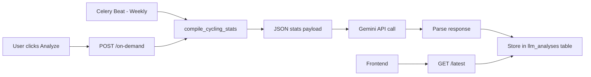
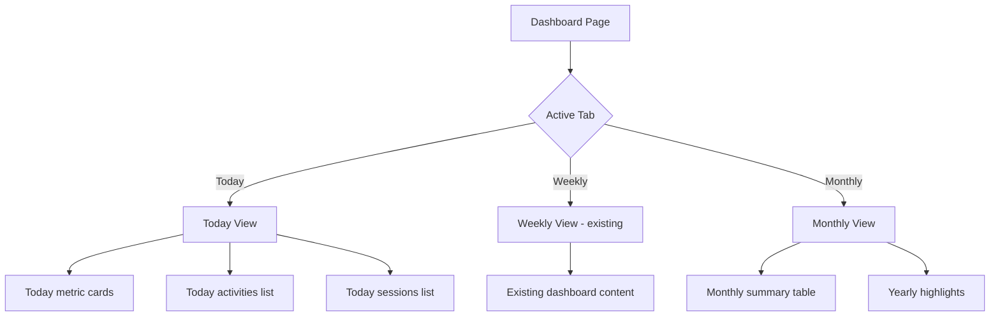

# Misc Features & Fixes Plan

> Created: 2026-08-20 | Status: Pending Approval

## Overview

Eight features/fixes across backend, frontend, and infrastructure:

1. **Weekly LLM Cycling Analysis** — Google Gemini analyzes cycling stats weekly + on-demand
2. **Static Analysis: Strength Sessions** — Comprehensive post-workout report for lifting
3. **Static Analysis: Ride Analysis** — Comprehensive post-workout report for rides
4. **Wiki Page** — In-app wiki with features, glossary, science, usage guide
5. **Dashboard Tabs** — Today | Weekly | Monthly tabbed dashboard view
6. **Remove Stream Cleanup** — Keep all streams forever (single user, ~25-40 MB/year)
7. **Remove Token Pasting** — Clean up all Whoop token paste references
8. **Prod Branch CD** — Deploy on push to `prod` instead of `main`

---

## Feature 1: Weekly LLM Cycling Analysis (Google Gemini)

### Architecture



### What the JSON stats payload includes
- Last 4 weeks of TSS, CTL, ATL, TSB
- Power curve (best efforts at each duration)
- FTP history and current FTP
- VO2max estimate
- Decoupling trends
- Weekly volume, distance, time
- Recovery/HRV/sleep trends from Whoop
- PR highlights from the period

### What Gemini returns
- Performance assessment (improving/plateauing/declining)
- Benchmark against typical amateur cyclist patterns
- Specific recommendations (e.g., "your threshold power is strong but endurance base needs work")
- Training load balance analysis
- Areas to focus on

### Files to create/modify

| File | Action |
|------|--------|
| `backend/app/config.py` | Add `gemini_api_key: str = ""` |
| `.env.example` | Add `GEMINI_API_KEY=` |
| `backend/app/models/llm_analysis.py` | New model — `LlmAnalysis` table |
| `backend/app/schemas/llm_analysis.py` | Pydantic schemas |
| `backend/app/services/llm_analysis.py` | Stats compilation + Gemini API call |
| `backend/app/api/llm_analysis.py` | `POST /on-demand`, `GET /latest` |
| `backend/app/main.py` | Register new router |
| `backend/app/tasks/scheduler.py` | Add weekly Celery task |
| `backend/alembic/versions/XXX_add_llm_analyses.py` | Migration |
| `frontend/src/lib/api/llmAnalysis.ts` | API client |
| `frontend/src/lib/api/types.ts` | TypeScript types |
| `frontend/src/lib/api/index.ts` | Barrel export |
| Dashboard or cycling page | LLM Analysis display card |

### Model schema

```
llm_analyses:
  id: UUID PK
  user_id: UUID FK -> users
  analysis_date: Date
  stats_json: JSONB          # the compiled stats sent to Gemini
  analysis_text: Text         # Gemini's response
  model_used: String          # e.g. "gemini-2.0-flash"
  created_at: DateTime
```

### Celery task
- Schedule: Weekly Sunday 5 AM UTC
- On-demand: `POST /api/v1/cycling/llm-analysis/on-demand`
- Stores result, returns latest via `GET /api/v1/cycling/llm-analysis/latest`

---

## Feature 2: Static Analysis — Strength Sessions

### What it analyzes

| Metric | Description |
|--------|-------------|
| Volume breakdown | Per-exercise volume distribution (pie chart) |
| Set progression | Weight/reps across sets for each exercise (line chart) |
| Rep dropoff | % decline from first to last working set |
| PR proximity | How close each top set is to the user's PR (estimated 1RM) |
| RPE vs load | RPE plotted against relative intensity |
| Fatigue index | Composite score based on rep dropoff and RPE |
| Session density | Volume per minute of session duration |

### Files to create/modify

| File | Action |
|------|--------|
| `backend/app/services/session_analysis.py` | New service — `analyze_lifting_session()` |
| `backend/app/api/lifting.py` | Add `GET /sessions/{id}/analysis` endpoint |
| `backend/app/schemas/lifting.py` | Add `LiftingAnalysisResponse` schema |
| `frontend/src/lib/api/types.ts` | TypeScript types |
| `frontend/src/lib/api/lifting.ts` | API client |
| `frontend/src/components/lifting/LiftingAnalysisCard.tsx` | New component |
| Lifting session detail view | Integrate analysis card |

---

## Feature 3: Static Analysis — Ride Analysis

### What it analyzes

| Metric | Description |
|--------|-------------|
| Intensity zones | Time in each power zone (bar chart, Coggan model) |
| Power distribution | Histogram of power values |
| Pacing analysis | Power over time with variance (line chart) |
| Variability Index | NP/AP — lower is more steady |
| Decoupling | HR vs power drift across ride halves |
| TSS breakdown | How TSS was accumulated (area chart) |
| Climbing analysis | VAM, elevation profile, power-to-weight on climbs |
| Efficiency factor | NP per heartbeat (aerobic efficiency) |
| Relative intensity | IF = NP/FTP |

### Files to create/modify

| File | Action |
|------|--------|
| `backend/app/services/session_analysis.py` | Add `analyze_ride()` function |
| `backend/app/api/activities.py` | Add `GET /{id}/analysis` endpoint |
| `backend/app/schemas/activity.py` | Add `RideAnalysisResponse` schema |
| `frontend/src/lib/api/types.ts` | TypeScript types |
| `frontend/src/lib/api/activities.ts` | API client |
| `frontend/src/components/cycling/RideAnalysisCard.tsx` | New component |
| Activity detail view | Integrate analysis card |

---

## Feature 4: Wiki Page

### Structure

```
/wiki
├── Overview          — What FitTrack does, feature list
├── Getting Started   — Setup, connecting integrations
├── Metrics Glossary  — Alphabetical glossary of all metrics
├── Science           — Training load models, formulas, research
└── Maximizing Impact — How to use the app effectively
```

### Glossary entries (key metrics)

TSS, CTL, ATL, TSB, FTP, NP, IF, VI, VAM, VO2max, decoupling, RPE, 1RM (Brzycki), HR zones, power zones, recovery score, strain, HRV, sleep efficiency, respiratory rate, EF (efficiency factor)

### Science section content

- **Training Stress Score** — how TSS is calculated (power-based and HR-based)
- **CTL/ATL/TSB model** — EWMA explanation, time constants (42-day/7-day), what the numbers mean
- **FTP estimation** — 20-min test, 8-min test, Riegel extrapolation
- **Normalized Power** — 30s rolling average, 4th power mean algorithm
- **Power zones** — Coggan 7-zone model
- **Brzycki 1RM formula** — weight × (36/(37-reps))
- **Decoupling** — cardiac drift concept, what <5% means
- **VO2max** — ACSM power formula, Uth HR formula

### Files to create/modify

| File | Action |
|------|--------|
| `frontend/src/app/(app)/wiki/page.tsx` | New wiki page with section navigation |
| `frontend/src/components/ui/Sidebar.tsx` (or equivalent) | Add wiki link |
| `frontend/src/lib/api/types.ts` | No API needed — static content |

---

## Feature 5: Dashboard Today/Weekly/Monthly Tabs

### Architecture



### Today view data

| Metric | Source |
|--------|--------|
| Today's TSS | Sum of Activity.tss for today |
| Today's activities | Activities with start_date = today |
| Today's lifting sessions | Sessions with session_date = today |
| Today's volume | Sum of LiftingSession.total_volume_kg for today |
| Latest recovery | Most recent DailyMetric.recovery_score |
| Latest HRV | Most recent DailyMetric.hrv_ms |
| Latest strain | Most recent DailyMetric.strain |
| Sleep last night | Most recent SleepLog |
| Active alerts | Count of active HealthAlerts |
| Training load snapshot | Current CTL/ATL/TSB |

### Files to create/modify

| File | Action |
|------|--------|
| `backend/app/api/dashboard.py` | Add `GET /today` endpoint |
| `backend/app/schemas/dashboard.py` | Add `TodaySummary` schema |
| `frontend/src/lib/api/dashboard.ts` | Add `getTodaySummary()` |
| `frontend/src/lib/api/types.ts` | Add `TodaySummary` type |
| `frontend/src/app/(app)/dashboard/page.tsx` | Refactor with tab navigation |

---

## Feature 6: Remove Stream Cleanup

### Change

Remove the stream deletion logic from `cleanup_old_data` in `scheduler.py`. The task body becomes a no-op (or removes only truly orphaned data if any). For a single user, streams consume ~25-40 MB/year — negligible.

### Files to modify

| File | Action |
|------|--------|
| `backend/app/tasks/scheduler.py` | Remove `delete(ActivityStream)` logic from `cleanup_old_data` |

---

## Feature 7: Remove Token Pasting References

### Changes

| File | What to remove/change |
|------|----------------------|
| `backend/app/api/connections.py` | Remove `WhoopTokenRequest` model, remove `connect_whoop_token` endpoint, update module docstring |
| `backend/app/services/whoop.py` | Update error messages: "paste a fresh token" → "reconnect via OAuth in Settings" (lines 190, 328, 1049) |

---

## Feature 8: Prod Branch CD

### Changes

| File | Change |
|------|--------|
| `.github/workflows/deploy.yml` | Change `branches: [main]` to `branches: [prod]` in workflow_run trigger |
| `.github/workflows/deploy.yml` | Change `git fetch origin main` / `git reset --hard origin/main` to `prod` |
| `.github/workflows/test.yml` | Add `prod` to push branches trigger |

---

## Implementation Order

The recommended implementation order groups related work and handles dependencies:

1. **Quick fixes** (Features 6, 7, 8) — no dependencies, fast wins
2. **Session analysis service** (Features 2, 3) — shared service file, backend-first
3. **Dashboard tabs** (Feature 5) — backend endpoint + frontend refactor
4. **LLM analysis** (Feature 1) — new model, migration, service, API, frontend
5. **Wiki page** (Feature 4) — frontend-only, no backend changes
6. **Documentation updates** — CODEMAP, AGENTS.md, README

Each feature should be implemented as a subtask by the orchestrator, with code mode handling the actual file changes.
