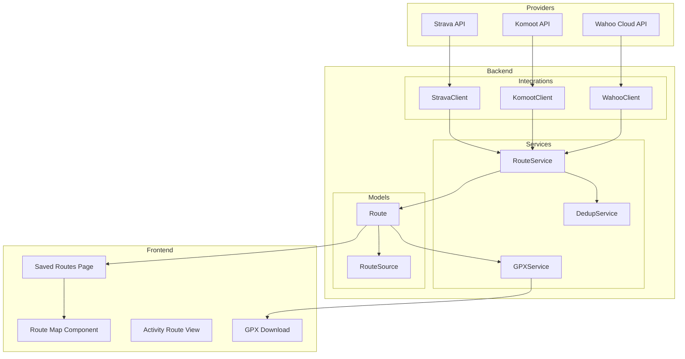
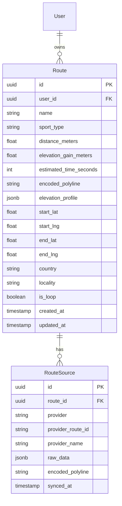

# Phase 3 — Cycling Integrations & Route Management

> Created: 2026-08-16
> Status: Planning

This plan covers cycling-specific integrations across Strava, Komoot, and Wahoo with a unified route management system. The core features are: route sync from all three providers, intelligent duplicate merging, interactive map display, GPX download, and a dedicated Saved Routes page.

---

## Architecture Overview



### Data Model



Key design decisions:
- **`Route`** is the canonical, user-facing route object with normalised geometry
- **`RouteSource`** tracks which provider(s) contributed to this route — a single logical route can have multiple sources (e.g., the same ride exported from both Strava and Komoot)
- **`encoded_polyline`** on `Route` stores the Google-encoded polyline for fast rendering; the `elevation_profile` JSONB stores elevation samples aligned to the polyline points
- **`start_lat/lng`** and **`end_lat/lng`** are denormalised for fast proximity queries during deduplication
- **`is_loop`** is computed from start/end proximity (within 200m)

---

## Work Items

### 1. Route & RouteSource Database Models

**Goal**: Create the core data models for route storage with multi-provider provenance tracking.

#### Approach

1. **Create [`backend/app/models/route.py`](../backend/app/models/route.py)** with two models:

   **`Route`**:
   ```python
   class Route(Base):
       __tablename__ = "routes"

       id: Mapped[uuid.UUID]          # UUID PK
       user_id: Mapped[uuid.UUID]     # FK → users
       name: Mapped[str]              # display name
       sport_type: Mapped[str]        # cycling, running, etc.
       distance_meters: Mapped[float]
       elevation_gain_meters: Mapped[float | None]
       estimated_time_seconds: Mapped[int | None]
       encoded_polyline: Mapped[str]  # Google-encoded polyline
       elevation_profile: Mapped[dict | None]  # JSONB — {distances: [...], elevations: [...]}
       start_lat: Mapped[float]
       start_lng: Mapped[float]
       end_lat: Mapped[float]
       end_lng: Mapped[float]
       country: Mapped[str | None]
       locality: Mapped[str | None]
       is_loop: Mapped[bool]          # computed: start/end within 200m
       raw_data: Mapped[dict | None]  # JSONB — source-specific metadata
       created_at / updated_at
   ```

   **`RouteSource`**:
   ```python
   class RouteSource(Base):
       __tablename__ = "route_sources"
       __table_args__ = (
           UniqueConstraint("provider", "provider_route_id", name="uq_route_source_provider"),
       )

       id: Mapped[uuid.UUID]
       route_id: Mapped[uuid.UUID]    # FK → routes
       provider: Mapped[str]          # strava, komoot, wahoo
       provider_route_id: Mapped[str]
       provider_name: Mapped[str]     # original name from provider
       encoded_polyline: Mapped[str]  # provider's polyline (may differ from canonical)
       raw_data: Mapped[dict | None]  # full API response
       synced_at: Mapped[datetime]
   ```

2. **Add relationships on [`User`](../backend/app/models/user.py)**:
   ```python
   routes: Mapped[list["Route"]] = relationship(back_populates="user", cascade="all, delete-orphan")
   ```

3. **Create Alembic migration `004_add_routes`** — two new tables with indexes on `(user_id, sport_type)` and `(start_lat, start_lng)` for proximity queries.

#### Files

| File | Change |
|------|--------|
| [`backend/app/models/route.py`](../backend/app/models/route.py) | **Create** — Route and RouteSource models |
| [`backend/app/models/user.py`](../backend/app/models/user.py) | Add `routes` relationship to User |
| [`backend/app/models/__init__.py`](../backend/app/models/__init__.py) | Import Route, RouteSource |
| [`backend/alembic/versions/004_add_routes.py`](../backend/alembic/versions/004_add_routes.py) | **Create** — migration |

---

### 2. Strava Route & Polyline Sync

**Goal**: Extract route geometry from Strava — both from the dedicated Routes API and from activity `map.summary_polyline` data.

#### Approach

1. **Extend [`StravaClient`](../backend/app/integrations/strava_client.py)** with two new methods:
   - `get_athlete_routes(access_token, page, per_page)` → `GET /api/v3/athletes/{id}/routes`
   - `get_route_detail(access_token, route_id)` → `GET /api/v3/routes/{id}` (returns full polyline + elevation)

2. **Create `sync_strava_routes()` in [`backend/app/services/strava.py`](../backend/app/services/strava.py)**:
   - Fetch athlete routes from Strava Routes API
   - For each route, extract: name, distance, elevation, encoded polyline, start/end coordinates
   - Also scan existing cycling `Activity` records that have `raw_data.map.summary_polyline` but no linked route — extract those as "activity-derived routes"
   - Pass each extracted route to the `RouteService.create_or_merge()` function (work item 5)

3. **Strava polyline sources**:
   - **Routes API**: Returns `map.polyline` (full resolution) and `map.summary_polyline`
   - **Activity data**: Already stored in `Activity.raw_data["map"]["summary_polyline"]` from the existing sync
   - Prefer the Routes API polyline when available (higher resolution)

#### Files

| File | Change |
|------|--------|
| [`backend/app/integrations/strava_client.py`](../backend/app/integrations/strava_client.py) | Add `get_athlete_routes()`, `get_route_detail()` |
| [`backend/app/services/strava.py`](../backend/app/services/strava.py) | Add `sync_strava_routes()` |

---

### 3. Komoot Integration — OAuth, Client & Route Sync

**Goal**: Full Komoot integration — OAuth connection, API client, and route/tour sync.

#### Komoot API Notes

- **OAuth2**: Komoot uses a custom OAuth2 flow at `https://api.komoot.de/v0.07/oauth2/authorize` with token endpoint at `https://api.komoot.de/v0.07/oauth2/token`
- **Scopes**: `read` for reading tours/routes
- **Tours API**: `GET https://api.komoot.de/v0.07/users/{user_id}/tours` — returns list of tours with embedded `coordinates` (GeoJSON-like embedded coordinate array) and `decodedCoordinate` (polyline)
- **Tour Detail**: `GET https://api.komoot.de/v0.07/tours/{tour_id}` — full geometry, elevation, segments
- **Routes API**: `GET https://api.komoot.de/v0.07/users/{user_id}/routes` — planned/saved routes
- **Auth**: Komoot authenticates via Basic Auth with `client_id:client_secret` for token exchange, and uses the `user_id` (Komoot internal ID) for API calls
- **Coordinate format**: Komoot returns coordinates as embedded HAL resources with `lat`, `lng`, `alt` arrays — needs conversion to encoded polyline

#### Approach

1. **Add Komoot OAuth config to [`backend/app/config.py`](../backend/app/config.py)**:
   ```python
   komoot_client_id: str = ""
   komoot_client_secret: str = ""
   ```

2. **Add Komoot to [`OAUTH_PROVIDERS`](../backend/app/services/auth.py)** in the auth service:
   ```python
   "komoot": {
       "authorize_url": "https://api.komoot.de/v0.07/oauth2/authorize",
       "token_url": "https://api.komoot.de/v0.07/oauth2/token",
       "userinfo_url": "https://api.komoot.de/v0.07/account",
       "client_id": lambda: settings.komoot_client_id,
       "client_secret": lambda: settings.komoot_client_secret,
       "scopes": "read",
   }
   ```

3. **Create [`backend/app/integrations/komoot_client.py`](../backend/app/integrations/komoot_client.py)**:
   ```python
   class KomootClient:
       async def exchange_code(self, code, redirect_uri) -> dict
       async def refresh_access_token(self, refresh_token) -> dict
       async def get_account(self, access_token) -> dict         # get user_id
       async def get_tours(self, access_token, user_id, page, per_page) -> list[dict]
       async def get_tour_detail(self, access_token, tour_id) -> dict
       async def get_routes(self, access_token, user_id, page, per_page) -> list[dict]
   ```

4. **Create [`backend/app/services/komoot.py`](../backend/app/services/komoot.py)**:
   - `sync_komoot_routes(db, user_id)` — fetches tours and routes, converts Komoot coordinate format to encoded polyline, passes to `RouteService.create_or_merge()`
   - `refresh_if_needed()` — token refresh logic (mirrors Strava pattern)
   - Komoot tours with `type` of `tour_sport_type_cycle` or `mtb` map to cycling

5. **Update [`connections.py`](../backend/app/api/connections.py)** — add Komoot sync handler in `trigger_sync()`

6. **Update `.env.example`** — add `KOMOOT_CLIENT_ID`, `KOMOOT_CLIENT_SECRET`

#### Files

| File | Change |
|------|--------|
| [`backend/app/config.py`](../backend/app/config.py) | Add `komoot_client_id`, `komoot_client_secret` |
| [`backend/app/services/auth.py`](../backend/app/services/auth.py) | Add Komoot to `OAUTH_PROVIDERS`, handle in `exchange_code_for_user()` |
| [`backend/app/integrations/komoot_client.py`](../backend/app/integrations/komoot_client.py) | **Create** — Komoot HTTP client |
| [`backend/app/services/komoot.py`](../backend/app/services/komoot.py) | **Create** — Komoot sync service |
| [`backend/app/api/connections.py`](../backend/app/api/connections.py) | Add Komoot sync handler |
| [`.env.example`](../.env.example) | Add Komoot env vars |

---

### 4. Wahoo Integration — OAuth, Client & Route Sync

**Goal**: Full Wahoo integration — OAuth connection, API client, and route/workout sync.

#### Wahoo Cloud API Notes

- **OAuth2**: Standard OAuth2 at `https://api.wahooligan.com/oauth/authorize` with token endpoint `https://api.wahooligan.com/oauth/token`
- **Scopes**: `user_read workouts_read routes_read` (space-separated)
- **Routes API**: `GET https://api.wahooligan.com/v1/routes` — returns list of routes with GPS data
- **Route Detail**: `GET https://api.wahooligan.com/v1/routes/{id}` — full route with `points` array (lat/lng/elevation)
- **Workouts API**: `GET https://api.wahooligan.com/v1/workouts` — completed workouts with file references
- **GPS format**: Wahoo returns route points as arrays of `[lat, lng, elevation]` — needs conversion to encoded polyline

#### Approach

1. **Add Wahoo OAuth config to [`backend/app/config.py`](../backend/app/config.py)** (already exists as `wahoo_client_id`/`wahoo_client_secret`)

2. **Add Wahoo to [`OAUTH_PROVIDERS`](../backend/app/services/auth.py)**:
   ```python
   "wahoo": {
       "authorize_url": "https://api.wahooligan.com/oauth/authorize",
       "token_url": "https://api.wahooligan.com/oauth/token",
       "userinfo_url": "https://api.wahooligan.com/v1/user",
       "client_id": lambda: settings.wahoo_client_id,
       "client_secret": lambda: settings.wahoo_client_secret,
       "scopes": "user_read workouts_read routes_read",
   }
   ```

3. **Create [`backend/app/integrations/wahoo_client.py`](../backend/app/integrations/wahoo_client.py)**:
   ```python
   class WahooClient:
       async def exchange_code(self, code, redirect_uri) -> dict
       async def refresh_access_token(self, refresh_token) -> dict
       async def get_user(self, access_token) -> dict
       async def get_routes(self, access_token, page, per_page) -> list[dict]
       async def get_route_detail(self, access_token, route_id) -> dict
       async def get_workouts(self, access_token, page, per_page) -> list[dict]
   ```

4. **Create [`backend/app/services/wahoo.py`](../backend/app/services/wahoo.py)**:
   - `sync_wahoo_routes(db, user_id)` — fetches Wahoo routes, converts point arrays to encoded polyline, passes to `RouteService.create_or_merge()`
   - `refresh_if_needed()` — token refresh logic

5. **Update [`connections.py`](../backend/app/api/connections.py)** — add Wahoo sync handler

6. **Update `.env.example`** — already has `WAHOO_CLIENT_ID`/`WAHOO_CLIENT_SECRET`

#### Files

| File | Change |
|------|--------|
| [`backend/app/services/auth.py`](../backend/app/services/auth.py) | Add Wahoo to `OAUTH_PROVIDERS`, handle in `exchange_code_for_user()` |
| [`backend/app/integrations/wahoo_client.py`](../backend/app/integrations/wahoo_client.py) | **Create** — Wahoo HTTP client |
| [`backend/app/services/wahoo.py`](../backend/app/services/wahoo.py) | **Create** — Wahoo sync service |
| [`backend/app/api/connections.py`](../backend/app/api/connections.py) | Add Wahoo sync handler |

---

### 5. Route Deduplication & Merging Service

**Goal**: Intelligently merge routes from different providers that represent the same real-world route.

#### Matching Algorithm

When a new route arrives from any provider, the system must determine if it already exists as a `Route` owned by the user. The algorithm uses a **weighted scoring system**:

```
Score = (proximity_score × 0.40) + (distance_score × 0.30) + (name_score × 0.15) + (shape_score × 0.15)
```

**Factors**:

| Factor | Weight | Method | Scoring |
|--------|--------|--------|---------|
| **Start/End proximity** | 40% | Haversine distance between start points and end points | start < 200m AND end < 200m → 1.0; start < 500m AND end < 500m → 0.7; else degrade |
| **Distance similarity** | 30% | Ratio of shorter/longer distance | Within 5% → 1.0; within 10% → 0.8; within 20% → 0.5; else 0.0 |
| **Name similarity** | 15% | SequenceMatcher on normalised names | Fuzzy ratio 0.0–1.0 |
| **Shape similarity** | 15% | Sample 20 evenly-spaced points from both polylines, compute average distance | Avg < 100m → 1.0; < 500m → 0.5; else 0.0 |

**Threshold**: 0.60 to consider a match.

**Merge strategy**:
- When a match is found, add a new `RouteSource` to the existing `Route` (don't duplicate the route)
- Keep the canonical `Route.encoded_polyline` as the highest-fidelity version (prefer Strava route polyline > Komoot > Wahoo > activity summary polyline)
- Update `Route` metadata (name, distance) if the new source has better data
- If no match, create a new `Route` + `RouteSource`

#### Approach

1. **Create [`backend/app/services/route_service.py`](../backend/app/services/route_service.py)**:
   ```python
   class RouteService:
       async def create_or_merge(
           db, user_id, name, sport_type, distance_meters, elevation_gain,
           encoded_polyline, elevation_profile, provider, provider_route_id,
           provider_name, raw_data, start_lat, start_lng, end_lat, end_lng,
       ) -> Route

       async def find_duplicate(db, user_id, route) -> Route | None

       async def merge_source(db, existing_route, new_source_data) -> RouteSource

       async def create_route(db, user_id, route_data, source_data) -> Route

       async def compute_is_loop(start_lat, start_lng, end_lat, end_lng) -> bool

       async def reverse_geocode(lat, lng) -> tuple[str | None, str | None]  # country, locality
   ```

2. **Create [`backend/app/services/polyline_utils.py`](../backend/app/services/polyline_utils.py)** — utility functions:
   - `decode_polyline(encoded) -> list[tuple[float, float]]` — decode Google-encoded polyline
   - `encode_polyline(points) -> str` — encode points to Google polyline
   - `haversine_distance(lat1, lng1, lat2, lng2) -> float` — distance in meters
   - `sample_polyline(encoded, n_points) -> list[tuple]` — evenly sample N points for shape comparison
   - `komoot_coordinates_to_polyline(coords) -> str` — convert Komoot's coordinate format
   - `wahoo_points_to_polyline(points) -> str` — convert Wahoo's point arrays

3. **Optional: Use PostGIS** for proximity queries if performance becomes an issue with many routes. For now, compute Haversine distances in Python (adequate for < 1000 routes per user).

#### Files

| File | Change |
|------|--------|
| [`backend/app/services/route_service.py`](../backend/app/services/route_service.py) | **Create** — core route CRUD + merge logic |
| [`backend/app/services/polyline_utils.py`](../backend/app/services/polyline_utils.py) | **Create** — polyline encode/decode, Haversine, sampling |

---

### 6. GPX Generation

**Goal**: Generate valid GPX 1.1 files from stored route data for download.

#### Approach

1. **Create [`backend/app/services/gpx.py`](../backend/app/services/gpx.py)**:
   ```python
   def route_to_gpx(route: Route) -> str:
       """Generate GPX 1.1 XML string from a Route object.

       Decodes the encoded_polyline, pairs with elevation_profile data,
       and produces a valid GPX document with <trk>/<trkseg>/<trkpt> elements.
       """
   ```

   GPX structure:
   ```xml
   <?xml version="1.0" encoding="UTF-8"?>
   <gpx version="1.1" creator="FitTrack"
     xmlns="http://www.topografix.com/GPX/1/1">
     <metadata>
       <name>{route.name}</name>
     </metadata>
     <trk>
       <name>{route.name}</name>
       <type>{route.sport_type}</type>
       <trkseg>
         <trkpt lat="51.5074" lon="-0.1278">
           <ele>15.2</ele>
         </trkpt>
         ...
       </trkseg>
     </trk>
   </gpx>
   ```

2. **Add download endpoint** in the routes API (work item 7): `GET /api/v1/routes/{id}/gpx` — returns the GPX file with `Content-Disposition: attachment` header.

#### Files

| File | Change |
|------|--------|
| [`backend/app/services/gpx.py`](../backend/app/services/gpx.py) | **Create** — GPX generation |

---

### 7. Route API Endpoints

**Goal**: RESTful API for route CRUD, filtering, and GPX download.

#### Approach

**Create [`backend/app/api/routes.py`](../backend/app/api/routes.py)**:

| Method | Path | Description |
|--------|------|-------------|
| `GET` | `/api/v1/routes` | List user's routes with filters (sport_type, source, is_loop, min_distance, max_distance, search by name) |
| `GET` | `/api/v1/routes/{id}` | Get route detail with all sources |
| `POST` | `/api/v1/routes` | Manually create a route (upload GPX or paste polyline) |
| `PATCH` | `/api/v1/routes/{id}` | Update route name/metadata |
| `DELETE` | `/api/v1/routes/{id}` | Delete route (cascades to sources) |
| `GET` | `/api/v1/routes/{id}/gpx` | Download route as GPX file |
| `POST` | `/api/v1/routes/sync` | Trigger route sync from all connected providers |
| `POST` | `/api/v1/routes/upload-gpx` | Upload a GPX file to create a new route |
| `GET` | `/api/v1/routes/duplicates` | List potential duplicate pairs (for manual review/merge) |
| `POST` | `/api/v1/routes/merge` | Manually merge two routes |

**Create [`backend/app/schemas/route.py`](../backend/app/schemas/route.py)**:
```python
class RouteSourceRead(BaseModel):
    id: uuid.UUID
    provider: str
    provider_route_id: str
    provider_name: str
    synced_at: datetime

class RouteRead(BaseModel):
    id: uuid.UUID
    name: str
    sport_type: str
    distance_meters: float
    elevation_gain_meters: float | None
    estimated_time_seconds: int | None
    encoded_polyline: str
    elevation_profile: dict | None
    start_lat: float
    start_lng: float
    end_lat: float
    end_lng: float
    country: str | None
    locality: str | None
    is_loop: bool
    sources: list[RouteSourceRead]
    created_at: datetime
    updated_at: datetime

class RouteCreate(BaseModel):
    name: str
    sport_type: str = "cycling"
    gpx_data: str | None = None        # GPX XML string
    encoded_polyline: str | None = None # or raw polyline

class RouteListParams(BaseModel):
    sport_type: str | None = None
    source: str | None = None
    is_loop: bool | None = None
    min_distance: float | None = None
    max_distance: float | None = None
    q: str | None = None               # name search
    limit: int = 50
    offset: int = 0

class MergeRequest(BaseModel):
    primary_route_id: uuid.UUID
    duplicate_route_id: uuid.UUID
```

**Register router** in [`backend/app/main.py`](../backend/app/main.py).

#### Files

| File | Change |
|------|--------|
| [`backend/app/api/routes.py`](../backend/app/api/routes.py) | **Create** — route API endpoints |
| [`backend/app/schemas/route.py`](../backend/app/schemas/route.py) | **Create** — Pydantic schemas |
| [`backend/app/main.py`](../backend/app/main.py) | Register routes router |

---

### 8. Background Route Sync Tasks

**Goal**: Automatically sync routes from all connected providers on a schedule.

#### Approach

**Extend [`backend/app/tasks/scheduler.py`](../backend/app/tasks/scheduler.py)**:

1. **Add `sync_all_routes` task** — runs every 2 hours:
   ```python
   @celery_app.task(name="app.tasks.scheduler.sync_all_routes")
   def sync_all_routes() -> dict:
       """Sync routes from all connected providers for all users."""
       # For each user with a Strava connection → sync_strava_routes()
       # For each user with a Komoot connection → sync_komoot_routes()
       # For each user with a Wahoo connection → sync_wahoo_routes()
   ```

2. **Add to Beat schedule**:
   ```python
   "sync-routes": {
       "task": "app.tasks.scheduler.sync_all_routes",
       "schedule": crontab(minute="0", hour="*/2"),  # every 2 hours
   },
   ```

3. **Update [`connections.py`](../backend/app/api/connections.py)** — manual sync should also trigger route sync for the specific provider.

#### Files

| File | Change |
|------|--------|
| [`backend/app/tasks/scheduler.py`](../backend/app/tasks/scheduler.py) | Add `sync_all_routes` task + Beat entry |

---

### 9. Frontend — Leaflet Map Component

**Goal**: Reusable map component that renders route polylines with elevation profiles.

#### Approach

1. **Install dependencies**:
   ```bash
   npm install leaflet react-leaflet @types/leaflet
   ```

2. **Create [`frontend/src/components/maps/RouteMap.tsx`](../frontend/src/components/maps/RouteMap.tsx)**:
   - Accepts `encodedPolyline: string` and optional `elevationProfile` prop
   - Renders an interactive Leaflet map with the route polyline
   - Uses OpenStreetMap tiles (free, no API key needed) or optionally MapTiler for styled tiles
   - Shows start/end markers with custom icons
   - For loop routes, shows the start/end as a single marker
   - Optional: elevation profile chart below the map (using Recharts, already in the project)
   - Handles SSR — Leaflet requires `window`, so dynamically import with `next/dynamic` and `ssr: false`

3. **Create [`frontend/src/components/maps/ElevationProfile.tsx`](../frontend/src/components/maps/ElevationProfile.tsx)**:
   - Recharts area chart showing elevation over distance
   - Shared hover/tooltip with the map (hovering on the chart highlights the position on the map and vice versa)

4. **Add Leaflet CSS** — import in `globals.css` or via `<link>` in layout:
   ```css
   @import 'leaflet/dist/leaflet.css';
   ```

#### Files

| File | Change |
|------|--------|
| [`frontend/package.json`](../frontend/package.json) | Add leaflet, react-leaflet, @types/leaflet |
| [`frontend/src/components/maps/RouteMap.tsx`](../frontend/src/components/maps/RouteMap.tsx) | **Create** — interactive route map |
| [`frontend/src/components/maps/ElevationProfile.tsx`](../frontend/src/components/maps/ElevationProfile.tsx) | **Create** — elevation area chart |
| [`frontend/src/app/globals.css`](../frontend/src/app/globals.css) | Import Leaflet CSS |

---

### 10. Frontend — Saved Routes Page

**Goal**: A dedicated page to browse, search, filter, and manage saved routes from all providers.

#### Approach

1. **Create [`frontend/src/app/(app)/routes/page.tsx`](../frontend/src/app/(app)/routes/page.tsx)**:

   **Layout**: Two-panel design:
   - **Left panel**: Scrollable list of routes with:
     - Search bar (name search)
     - Filter dropdowns: sport type, source provider, loop/point-to-point, distance range
     - Route cards showing: name, distance, elevation gain, source badges (Strava/Komoot/Wahoo icons), loop indicator, mini map preview (static polyline thumbnail)
     - Pagination / infinite scroll
   - **Right panel** (or modal on mobile): Selected route detail with:
     - Full interactive `RouteMap` component
     - `ElevationProfile` chart
     - Metadata: distance, elevation, estimated time, country/locality
     - Source list (which providers this route was synced from)
     - **Download GPX** button
     - Edit name / Delete actions

2. **Add "Routes" to Sidebar navigation** in [`Sidebar.tsx`](../frontend/src/components/Sidebar.tsx):
   ```typescript
   { href: '/routes', label: 'Routes', icon: '🗺️' }
   ```

3. **Add route types to [`api.ts`](../frontend/src/lib/api.ts)**:
   ```typescript
   export interface RouteSource {
     id: string;
     provider: string;
     provider_route_id: string;
     provider_name: string;
     synced_at: string;
   }

   export interface Route {
     id: string;
     name: string;
     sport_type: string;
     distance_meters: number;
     elevation_gain_meters?: number;
     estimated_time_seconds?: number;
     encoded_polyline: string;
     elevation_profile?: ElevationProfile;
     start_lat: number;
     start_lng: number;
     end_lat: number;
     end_lng: number;
     country?: string;
     locality?: string;
     is_loop: boolean;
     sources: RouteSource[];
     created_at: string;
     updated_at: string;
   }

   export interface RouteFilters {
     sport_type?: string;
     source?: string;
     is_loop?: boolean;
     min_distance?: number;
     max_distance?: number;
     q?: string;
     limit?: number;
     offset?: number;
   }
   ```

4. **GPX Download** — Use `apiFetch` to get the GPX as a blob, then trigger a browser download:
   ```typescript
   async function downloadGpx(routeId: string, routeName: string) {
     const blob = await authFetch(`/api/v1/routes/${routeId}/gpx`, { /* response type: blob */ });
     const url = URL.createObjectURL(blob);
     const a = document.createElement('a');
     a.href = url; a.download = `${routeName}.gpx`; a.click();
   }
   ```

#### Files

| File | Change |
|------|--------|
| [`frontend/src/app/(app)/routes/page.tsx`](../frontend/src/app/(app)/routes/page.tsx) | **Create** — Saved Routes page |
| [`frontend/src/components/Sidebar.tsx`](../frontend/src/components/Sidebar.tsx) | Add Routes nav item |
| [`frontend/src/lib/api.ts`](../frontend/src/lib/api.ts) | Add Route, RouteSource, RouteFilters types |

---

### 11. Activity Route Display

**Goal**: Show the route map on cycling activity detail views.

#### Approach

1. **Update the activity detail view** in [`frontend/src/app/(app)/activities/page.tsx`](../frontend/src/app/(app)/activities/page.tsx):
   - For cycling/running/walking activities that have a `map.summary_polyline` in `raw_data`, render a `RouteMap` component
   - If the activity is linked to a `Route` (via `RouteSource` matching the activity's `provider_activity_id`), show a "View saved route" link
   - The activity's polyline comes from `raw_data.map.summary_polyline` (already stored in the DB from Strava sync)

2. **Add polyline to Activity schema** — optionally add an `encoded_polyline` field directly on `Activity` for convenience, or extract from `raw_data` on the fly. Prefer extracting from `raw_data` to avoid schema changes — the frontend can access `activity.raw_data?.map?.summary_polyline`.

3. **Extend [`ActivityRead`](../backend/app/schemas/activity.py)** with an optional `encoded_polyline: str | None` field that is populated from `raw_data["map"]["summary_polyline"]` in the API layer.

#### Files

| File | Change |
|------|--------|
| [`frontend/src/app/(app)/activities/page.tsx`](../frontend/src/app/(app)/activities/page.tsx) | Add route map for cycling/running activities |
| [`backend/app/schemas/activity.py`](../backend/app/schemas/activity.py) | Add optional `encoded_polyline` to `ActivityRead` |
| [`backend/app/api/activities.py`](../backend/app/api/activities.py) | Populate `encoded_polyline` from `raw_data` |

---

### 12. Settings Page — Activate Komoot & Wahoo

**Goal**: Enable the Komoot and Wahoo integrations on the Settings page.

#### Approach

1. **Update [`frontend/src/app/(app)/settings/page.tsx`](../frontend/src/app/(app)/settings/page.tsx)**:
   - Add Komoot to the integrations list (replace "Coming Soon" with active connect button)
   - Update Wahoo to be active (remove `available: false`)
   - Update descriptions to reflect route sync capabilities:
     - Strava: "Sync activities, routes, and GPS data"
     - Komoot: "Sync planned routes and completed tours with GPS data"
     - Wahoo: "Sync routes and workouts from Wahoo devices"

2. **Add Komoot icon/color**: `{ id: 'komoot', name: 'Komoot', icon: '🗺️', color: 'bg-green-600', available: true }`

#### Files

| File | Change |
|------|--------|
| [`frontend/src/app/(app)/settings/page.tsx`](../frontend/src/app/(app)/settings/page.tsx) | Activate Komoot + Wahoo integrations |

---

### 13. GPX Upload Support

**Goal**: Allow users to manually upload GPX files to create routes not tied to any provider.

#### Approach

1. **Add `POST /api/v1/routes/upload-gpx` endpoint** — accepts a GPX XML file upload (`multipart/form-data`)

2. **Create GPX parser** in [`backend/app/services/gpx.py`](../backend/app/services/gpx.py):
   ```python
   def parse_gpx(gpx_xml: str) -> dict:
       """Parse GPX 1.1 XML and extract route data.

       Returns: {name, points: [(lat, lng, ele), ...], sport_type}
       """
   ```

3. **Frontend**: Add an "Upload GPX" button on the Routes page that opens a file picker, sends the file to the backend, and refreshes the route list.

#### Files

| File | Change |
|------|--------|
| [`backend/app/services/gpx.py`](../backend/app/services/gpx.py) | Add `parse_gpx()` |
| [`backend/app/api/routes.py`](../backend/app/api/routes.py) | Add `POST /upload-gpx` endpoint |
| [`frontend/src/app/(app)/routes/page.tsx`](../frontend/src/app/(app)/routes/page.tsx) | Add GPX upload UI |

---

## Polyline Encoding Reference

Google's Encoded Polyline Algorithm is used throughout:
- **Strava** returns polylines natively in this format
- **Komoot** returns coordinates as embedded HAL resources — convert with [`komoot_coordinates_to_polyline()`](../backend/app/services/polyline_utils.py)
- **Wahoo** returns `[lat, lng, elevation]` point arrays — convert with [`wahoo_points_to_polyline()`](../backend/app/services/polyline_utils.py)

The encoding/decoding implementation follows the [Google Polyline Algorithm](https://developers.google.com/maps/documentation/utilities/polylinealgorithm) and can use the `polyline` PyPI package or a hand-rolled implementation.

---

## Dependency Additions

### Backend

```
# pyproject.toml — [project.dependencies]
polyline>=2.0        # Google polyline encode/decode
gpxpy>=1.6           # GPX parsing (optional, can hand-roll)
```

### Frontend

```
# package.json — dependencies
leaflet>=1.9
react-leaflet>=4.2
@types/leaflet>=1.9   # devDependency
```

---

## Summary of New/Modified Files

### New Files

| File | Purpose |
|------|---------|
| `backend/app/models/route.py` | Route and RouteSource ORM models |
| `backend/alembic/versions/004_add_routes.py` | Migration for routes tables |
| `backend/app/integrations/komoot_client.py` | Komoot API HTTP client |
| `backend/app/integrations/wahoo_client.py` | Wahoo API HTTP client |
| `backend/app/services/komoot.py` | Komoot sync service |
| `backend/app/services/wahoo.py` | Wahoo sync service |
| `backend/app/services/route_service.py` | Route CRUD + dedup/merge logic |
| `backend/app/services/polyline_utils.py` | Polyline encode/decode + Haversine |
| `backend/app/services/gpx.py` | GPX generation + parsing |
| `backend/app/api/routes.py` | Route REST API endpoints |
| `backend/app/schemas/route.py` | Route Pydantic schemas |
| `frontend/src/components/maps/RouteMap.tsx` | Interactive Leaflet map component |
| `frontend/src/components/maps/ElevationProfile.tsx` | Elevation profile chart |
| `frontend/src/app/(app)/routes/page.tsx` | Saved Routes page |

### Modified Files

| File | Change |
|------|--------|
| `backend/app/config.py` | Add `komoot_client_id`, `komoot_client_secret` |
| `backend/app/models/user.py` | Add `routes` relationship |
| `backend/app/models/__init__.py` | Import new models |
| `backend/app/services/auth.py` | Add Komoot + Wahoo to OAUTH_PROVIDERS |
| `backend/app/integrations/strava_client.py` | Add route API methods |
| `backend/app/services/strava.py` | Add `sync_strava_routes()` |
| `backend/app/api/connections.py` | Add Komoot/Wahoo sync handlers |
| `backend/app/tasks/scheduler.py` | Add route sync task + Beat schedule |
| `backend/app/main.py` | Register routes router |
| `backend/app/schemas/activity.py` | Add `encoded_polyline` field |
| `backend/app/api/activities.py` | Populate polyline from raw_data |
| `frontend/src/components/Sidebar.tsx` | Add Routes nav item |
| `frontend/src/lib/api.ts` | Add route types |
| `frontend/src/app/(app)/activities/page.tsx` | Add route map for cycling activities |
| `frontend/src/app/(app)/settings/page.tsx` | Activate Komoot + Wahoo |
| `frontend/src/app/globals.css` | Import Leaflet CSS |
| `.env.example` | Add Komoot env vars |
