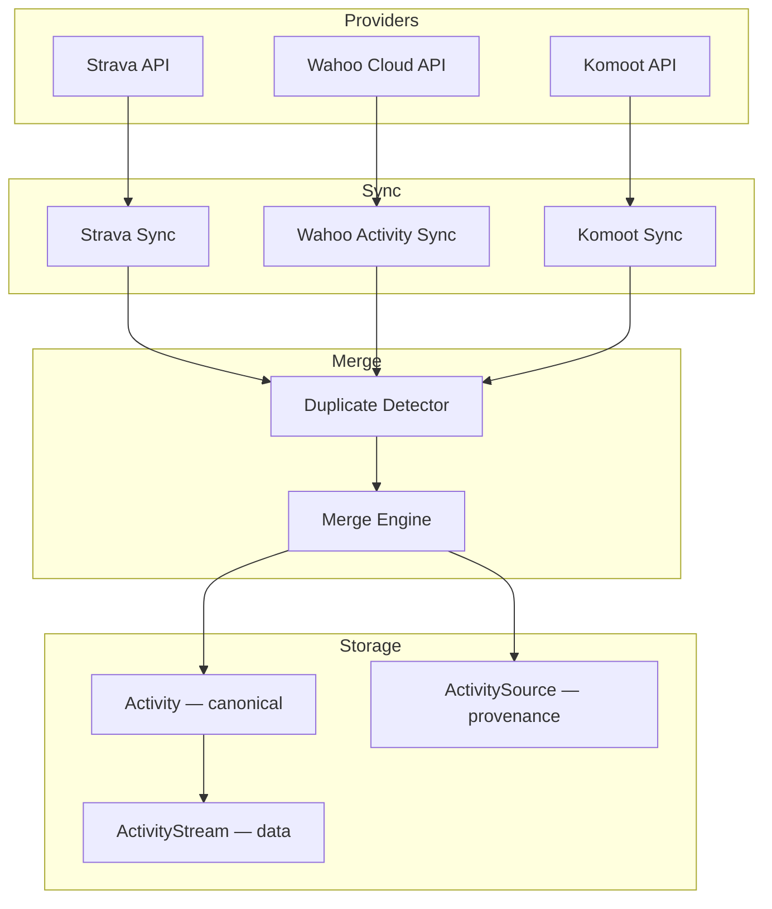
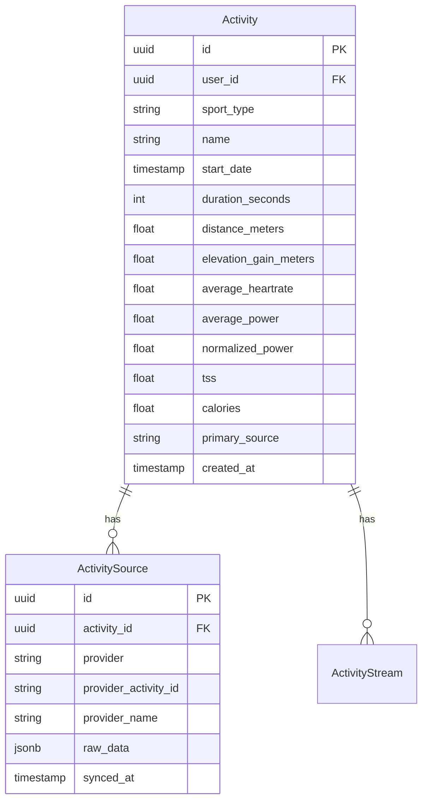
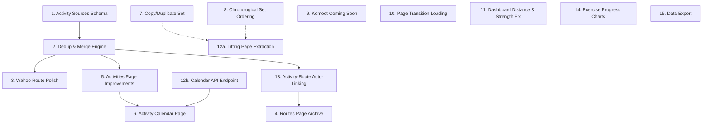

# Phase 4 — Multi-Provider Merging, Page Polish & Lifting UX

> Created: 2026-08-16
> Status: Planning

This plan covers activity merging across providers, route and activities page improvements, a new calendar page, lifting UX enhancements, and various UI polish items.

### Phase 3 Status

All 13 Phase 3 items are **fully implemented** (route models, Strava/Komoot/Wahoo sync, route dedup, GPX gen, Leaflet maps, Routes page, activity route display, settings integrations, GPX upload). No Phase 3 items need to be absorbed into Phase 4. Komoot integration is functional but will be marked "Coming Soon" on the settings page (work item 9) until HTTPS OAuth callbacks are configured for local development.

### Design Decisions

- **Calendar library**: [`react-day-picker`](https://react-day-picker.js.org/) — lightweight (~12KB), highly customizable with Tailwind, supports custom day renderers for activity dots/badges, modern v9 with TypeScript support
- **Merge thresholds**: Configurable via environment variables in [`backend/app/config.py`](backend/app/config.py) — `ACTIVITY_MERGE_THRESHOLD` (default 0.65), `ACTIVITY_ROUTE_LINK_THRESHOLD` (default 0.70), `ROUTE_DEDUP_THRESHOLD` (default 0.60, already exists)

---

## Architecture Overview

### Activity Merging

The biggest architectural change in Phase 4 is **activity merging** — when the same physical activity is tracked by multiple providers (e.g., a ride recorded on both Strava and Wahoo), the system should detect the duplicate and merge the data into a single canonical `Activity` record.

This mirrors the existing [`Route`](backend/app/models/route.py) / [`RouteSource`](backend/app/models/route.py) pattern already proven in Phase 3.



### Data Model — Activity Sources



Key design decisions:
- **`Activity`** remains the canonical, user-facing activity record with normalised fields
- **`ActivitySource`** tracks which provider(s) contributed — a single activity can have multiple sources
- **`primary_source`** stays on `Activity` as a denormalised hint for UI display (which provider icon to show)
- **`source`** and **`provider_activity_id`** are removed from `Activity` and moved to `ActivitySource`
- **`raw_data`** stays on `Activity` (merged/primary) but the full provider response is in `ActivitySource.raw_data`
- Deduplication uses a weighted scoring algorithm similar to routes: date proximity (±2 hours), sport type match, duration similarity (±20%), distance similarity (±15%)
- Merge priority: Strava > Wahoo > Komoot (Strava data is preferred when both providers have the same field)

---

## Work Items

### 1. Activity Merging — Backend Schema & Migration

**Goal**: Create the `ActivitySource` model and migration to support multi-provider activity merging.

#### Approach

1. **Create `ActivitySource` model** in [`backend/app/models/activity.py`](backend/app/models/activity.py):
   ```python
   class ActivitySource(Base):
       __tablename__ = "activity_sources"
       __table_args__ = (
           UniqueConstraint("provider", "provider_activity_id", name="uq_activity_source_provider"),
       )

       id: Mapped[uuid.UUID]
       activity_id: Mapped[uuid.UUID]      # FK → activities
       provider: Mapped[str]                # strava, wahoo, komoot
       provider_activity_id: Mapped[str]
       provider_name: Mapped[str | None]    # original name from provider
       raw_data: Mapped[dict | None]        # full API response
       synced_at: Mapped[datetime]
   ```

2. **Add relationship on `Activity`**:
   ```python
   sources: Mapped[list["ActivitySource"]] = relationship(back_populates="activity", cascade="all, delete-orphan")
   ```

3. **Keep `source` on `Activity`** as a denormalised `primary_source` field (renamed). Keep `provider_activity_id` temporarily for backward compatibility during migration.

4. **Create Alembic migration `008_add_activity_sources`**:
   - Create `activity_sources` table
   - Backfill: for each existing `Activity`, create an `ActivitySource` row from `(source, provider_activity_id, raw_data)`
   - Add indexes on `(activity_id)` and `(provider, provider_activity_id)`

#### Files

| File | Change |
|------|--------|
| [`backend/app/models/activity.py`](backend/app/models/activity.py) | Add `ActivitySource` model, add `sources` relationship on `Activity` |
| [`backend/app/models/__init__.py`](backend/app/models/__init__.py) | Import `ActivitySource` |
| [`backend/alembic/versions/008_add_activity_sources.py`](backend/alembic/versions/008_add_activity_sources.py) | **Create** — migration with backfill |
| [`backend/app/schemas/activity.py`](backend/app/schemas/activity.py) | Add `ActivitySourceRead` schema, update `ActivityRead` with `sources` list |

---

### 2. Activity Merging — Dedup & Merge Engine

**Goal**: When syncing activities from any provider, detect duplicates and merge into a single canonical record.

#### Approach

1. **Add configurable thresholds to [`backend/app/config.py`](backend/app/config.py)**:
   ```python
   activity_merge_threshold: float = 0.65
   activity_route_link_threshold: float = 0.70
   ```
   Read from environment variables `ACTIVITY_MERGE_THRESHOLD` and `ACTIVITY_ROUTE_LINK_THRESHOLD`.

2. **Create `merge_service.py`** in [`backend/app/services/`](backend/app/services/):
   - `find_duplicate_activity(db, user_id, sport_type, start_date, duration_s, distance_m)` → returns the best-matching existing `Activity` or `None`
   - Scoring algorithm:
     - **Date proximity** (within 2 hours = 1.0, within 6 hours = 0.5, else 0) — weight 50%
     - **Sport type match** (exact = 1.0, compatible = 0.5, else 0) — weight 20%
     - **Duration similarity** (ratio of shorter/longer) — weight 15%
     - **Distance similarity** (ratio of shorter/longer, skip if either is null) — weight 15%
   - Threshold: configurable via `settings.activity_merge_threshold` (default **0.65**)
   - `merge_activity(db, primary_activity, new_data, provider, provider_activity_id)` → updates the primary activity with supplementary data, creates `ActivitySource`
   - Merge priority for conflicting fields: Strava > Wahoo > Komoot

3. **Update [`sync_activities()`](backend/app/services/strava.py)** to use the merge engine after creating each activity.

4. **Create `sync_wahoo_activities()`** in [`backend/app/services/wahoo.py`](backend/app/services/wahoo.py):
   - Fetch workouts from Wahoo API using existing [`WahooClient.get_workouts()`](backend/app/integrations/wahoo_client.py:101)
   - Map Wahoo workout data to `Activity` fields
   - Use merge engine to detect duplicates with existing Strava/Wahoo activities
   - Compute TSS if power data and FTP are available

5. **Update [`sync_all_strava_activities`](backend/app/tasks/scheduler.py)** Celery task to also sync Wahoo activities for users with Wahoo connections.

6. **Add `POST /api/v1/connections/{id}/sync` support** for Wahoo connections (currently only Strava is fully supported for activity sync).

#### Files

| File | Change |
|------|--------|
| [`backend/app/config.py`](backend/app/config.py) | Add `activity_merge_threshold`, `activity_route_link_threshold` |
| [`backend/app/services/merge_service.py`](backend/app/services/merge_service.py) | **Create** — dedup scoring, merge logic |
| [`backend/app/services/strava.py`](backend/app/services/strava.py) | Update `sync_activities()` to use merge engine |
| [`backend/app/services/wahoo.py`](backend/app/services/wahoo.py) | Add `sync_wahoo_activities()` |
| [`backend/app/integrations/wahoo_client.py`](backend/app/integrations/wahoo_client.py) | Add `get_workout_detail()` if needed |
| [`backend/app/tasks/scheduler.py`](backend/app/tasks/scheduler.py) | Add Wahoo activity sync to beat schedule |
| [`backend/app/api/connections.py`](backend/app/api/connections.py) | Support Wahoo activity sync on manual trigger |
| [`backend/app/schemas/activity.py`](backend/app/schemas/activity.py) | Add `ActivitySourceRead` |
| [`backend/alembic/env.py`](backend/alembic/env.py) | Import new model |

---

### 3. Wahoo Route Sync Polish

**Goal**: Ensure Wahoo route sync is robust and handles edge cases well.

#### Approach

1. **Review and harden [`sync_wahoo_routes()`](backend/app/services/wahoo.py:48)**:
   - Handle pagination properly (already implemented, verify edge cases)
   - Add error handling for missing GPS data (already has fallback to route detail)
   - Ensure polyline generation works for all Wahoo point formats
   - Add elevation profile extraction from Wahoo point data (currently only extracts distance)

2. **Add Wahoo route sync to the Celery Beat schedule** (already done in Phase 3 via `sync_all_routes`, verify it works).

3. **Test the merge/dedup with routes from multiple providers** — ensure the same ride synced from both Strava and Wahoo produces one merged route.

#### Files

| File | Change |
|------|--------|
| [`backend/app/services/wahoo.py`](backend/app/services/wahoo.py) | Harden sync, add elevation profile extraction |
| [`backend/app/services/polyline_utils.py`](backend/app/services/polyline_utils.py) | Add elevation profile extraction from point arrays if needed |

---

### 4. Routes Page — Route Archive

**Goal**: Transform the Routes page into a **route archive** — a comprehensive library of every route you've ever ridden, with intelligent merging of duplicates across providers and clear provenance tracking.

> **Already built**: Route merging via [`create_or_merge_route()`](backend/app/services/route_service.py) already detects duplicates using a weighted scoring algorithm (start/end proximity 40%, distance 30%, name 15%, shape 15%) with a 0.60 threshold. Provider icons (Strava 🟠, Komoot 🟢, Wahoo 🔵) are already displayed on route cards. The [`Route`](backend/app/models/route.py) / [`RouteSource`](backend/app/models/route.py) model tracks multi-provider provenance.

#### Approach

1. **Add route usage stats** — Backend:
   - Extend `GET /api/v1/routes` response to include `ride_count` and `last_ridden_date` per route
   - Compute by matching activities to routes via start coordinate proximity + sport type + date
   - Add a `GET /api/v1/routes/{id}/activity-history` endpoint showing all activities that used this route

2. **Add sort options** to the route list:
   - By name (alphabetical)
   - By distance (shortest/longest)
   - By last ridden (most/least recent)
   - By ride count (most/least popular)
   - By date added (newest/oldest)
   - Backend: add `sort_by` and `sort_order` query params to `GET /api/v1/routes`

3. **Add distance and elevation range filters**:
   - `min_distance`, `max_distance`, `min_elevation`, `max_elevation` query params
   - Frontend: add range inputs to the filter bar

4. **Improve route detail panel** — the archive should tell the full story of a route:
   - Show ride count and last ridden date prominently
   - Show all contributing providers with individual sync dates and provider-specific names
   - Show the "best" data from all providers (merged elevation, distance, time)
   - Activity history timeline — when was this route ridden and what were the results?
   - Add "Favourite" toggle for pinning frequently-used routes (optional — stretch goal)

5. **Push route to Wahoo** — Send non-Wahoo routes to the user's Wahoo ELEMNT head unit:
   - Add [`WahooClient.create_route()`](backend/app/integrations/wahoo_client.py) method — `POST /v1/routes` with GPX or polyline data
   - Add [`push_route_to_wahoo()`](backend/app/services/wahoo.py) service function that converts the route to Wahoo's expected format and uploads it
   - Add `POST /api/v1/routes/{id}/push-to-wahoo` API endpoint
   - Frontend: add a "📱 Send to Wahoo" button in the route detail panel, visible only when the route does NOT have a Wahoo source (i.e., it came from Strava/Komoot/manual upload)
   - Show success/error feedback after push

6. **Frontend archive UX**:
   - Add a route count badge in the page header (e.g., "47 routes archived")
   - Add skeleton loaders instead of "Loading routes..." text
   - Improve mobile layout (stack list + detail vertically)
   - Add empty state with guidance on how to populate the archive

#### Files

| File | Change |
|------|--------|
| [`backend/app/api/routes.py`](backend/app/api/routes.py) | Add sort params, distance/elevation range filters, ride count, activity history endpoint, push-to-wahoo endpoint |
| [`backend/app/schemas/route.py`](backend/app/schemas/route.py) | Add `ride_count`, `last_ridden_date` to `RouteSummary` |
| [`backend/app/integrations/wahoo_client.py`](backend/app/integrations/wahoo_client.py) | Add `create_route()` method |
| [`backend/app/services/wahoo.py`](backend/app/services/wahoo.py) | Add `push_route_to_wahoo()` service |
| [`frontend/src/app/(app)/routes/page.tsx`](frontend/src/app/(app)/routes/page.tsx) | Archive UX: sort controls, range filters, ride stats, provider provenance, push-to-wahoo button, skeleton loaders |
| [`frontend/src/lib/api.ts`](frontend/src/lib/api.ts) | Update `RouteSummary` type, add `RouteFilters` sort fields |

---

### 5. Activities Page Improvements

**Goal**: Transform the Activities page into a focused **activity log** — review what you did, see the data, drill into details. Sport-type-aware display.

#### Approach

1. **Sport-type-aware display**:
   - Strength activities: hide distance, show duration + linked session summary
   - Cycling/running: show distance, duration, power, TSS
   - Swimming: show distance, duration, pace
   - Frontend: conditionally render stats columns based on `sport_type`

2. **Period grouping**:
   - Add a toggle: "List view" (current) vs "Week view" (grouped by week)
   - Week view shows week headers with summary stats (total distance, time, TSS, sessions)
   - Frontend-only change — group the already-sorted activity list by ISO week

3. **Summary stats bar**:
   - Show filtered period totals at the top: total distance, total time, total TSS, activity count
   - Updates dynamically when filters change
   - Computed client-side from the loaded activity list

4. **Multi-provider source display**:
   - For merged activities, show all contributing provider badges (e.g., Strava + Wahoo)
   - Frontend: render `ActivitySource` badges next to the activity name

5. **Remove distance from strength activities** in the recent activities list on both the Activities page and the Dashboard page.

#### Files

| File | Change |
|------|--------|
| [`frontend/src/app/(app)/activities/page.tsx`](frontend/src/app/(app)/activities/page.tsx) | Sport-type-aware display, period grouping, summary stats, multi-provider badges |
| [`frontend/src/app/(app)/dashboard/page.tsx`](frontend/src/app/(app)/dashboard/page.tsx) | Hide distance for strength activities in recent activities |
| [`frontend/src/lib/api.ts`](frontend/src/lib/api.ts) | Update `Activity` type with `sources` field |
| [`backend/app/schemas/activity.py`](backend/app/schemas/activity.py) | Include `sources` in `ActivityRead` response |

---

### 6. Activity Calendar Page

**Goal**: A new calendar page that auto-populates with activities, providing a visual overview of training consistency.

#### Approach

1. **Install `react-day-picker`**:
   ```bash
   npm install react-day-picker date-fns
   ```
   `date-fns` is the recommended date library for `react-day-picker` v9.

2. **Create new page** [`frontend/src/app/(app)/calendar/page.tsx`](frontend/src/app/(app)/calendar/page.tsx):
   - Monthly calendar using [`react-day-picker`](https://react-day-picker.js.org/) with custom day renderer
   - Each day cell shows activity icons/badges for that day (small colored dots or sport type abbreviations)
   - Color-coded by sport type (cycling = blue, running = green, strength = purple, etc.)
   - Selected day shows a detail panel below or beside the calendar
   - Month navigation via built-in nav buttons
   - Today highlighted, selected day highlighted
   - Tailwind-styled to match the app's dark theme

3. **Backend**: No new endpoints needed for basic calendar — the existing `GET /api/v1/activities?start_date_after=X&start_date_before=Y` endpoint supports date range filtering. For the lightweight calendar endpoint (work item 12b), add `GET /api/v1/activities/calendar`.

4. **Frontend data fetching**:
   - Fetch activities for the visible month using date range filters
   - Group by date client-side using `date-fns` `format()` and `groupBy()`
   - Cache with React Query using `['activities', { start_date_after, start_date_before }]` keys

5. **Add to sidebar navigation** in [`Sidebar.tsx`](frontend/src/components/Sidebar.tsx).

6. **Day detail panel**:
   - Shows all activities for the selected day
   - Each activity shows sport type badge, name, duration, distance (if applicable)
   - Links to full activity detail on the Activities page

#### Files

| File | Change |
|------|--------|
| [`frontend/package.json`](frontend/package.json) | Add `react-day-picker`, `date-fns` |
| [`frontend/src/app/(app)/calendar/page.tsx`](frontend/src/app/(app)/calendar/page.tsx) | **Create** — calendar page using react-day-picker |
| [`frontend/src/components/Sidebar.tsx`](frontend/src/components/Sidebar.tsx) | Add calendar nav item |
| [`frontend/src/lib/api.ts`](frontend/src/lib/api.ts) | Add `CalendarDay` helper type if needed |

---

### 7. Lifting UX — Copy/Duplicate Set Button

**Goal**: Add a "duplicate last set" button when adding sets to an exercise, reducing repetitive data entry.

#### Approach

1. **In [`AddExerciseForm`](frontend/src/app/(app)/lifting/page.tsx:448)**:
   - Add a "📋 Copy Last Set" button next to the existing "+ Add Set" button
   - When clicked, appends a new set row pre-filled with the last set's weight, reps, RPE, and flags
   - Increments the set number automatically

2. **In [`ExerciseGroup`](frontend/src/app/(app)/lifting/page.tsx:707)** (session detail view):
   - Add a "📋 Duplicate" button in the actions column for each set
   - When clicked, opens the add-set flow pre-filled with that set's values

#### Files

| File | Change |
|------|--------|
| [`frontend/src/app/(app)/lifting/page.tsx`](frontend/src/app/(app)/lifting/page.tsx) | Add copy/duplicate buttons to `AddExerciseForm` and `ExerciseGroup` |

---

### 8. Lifting UX — Chronological Set Ordering

**Goal**: Display sets in the order they were added (chronological), not in an undefined order.

#### Approach

1. **Add `created_at` to `LiftingSet` model** in [`backend/app/models/lifting.py`](backend/app/models/lifting.py):
   ```python
   created_at: Mapped[datetime] = mapped_column(DateTime(timezone=True), server_default=func.now())
   ```

2. **Add `order_by` to the `sets` relationship** on `LiftingSession`:
   ```python
   sets: Mapped[list["LiftingSet"]] = relationship(
       back_populates="session",
       cascade="all, delete-orphan",
       order_by="LiftingSet.created_at"
   )
   ```

3. **Create Alembic migration `009_add_lifting_set_created_at`**:
   - Add `created_at` column with `server_default=now()`
   - Backfill existing rows: set `created_at` based on session's `created_at` + an offset per `set_number`

4. **Frontend**: No changes needed — the `groupSetsByExercise` function already preserves array order, and the backend will now return sets in chronological order.

#### Files

| File | Change |
|------|--------|
| [`backend/app/models/lifting.py`](backend/app/models/lifting.py) | Add `created_at` to `LiftingSet`, add `order_by` to relationship |
| [`backend/alembic/versions/009_add_lifting_set_created_at.py`](backend/alembic/versions/009_add_lifting_set_created_at.py) | **Create** — migration |

---

### 9. Settings Page — Komoot Coming Soon

**Goal**: Mark Komoot as "Coming Soon" on the Settings page since the OAuth integration requires HTTPS callback URLs that aren't yet configured for local development.

#### Approach

1. **Update the `integrations` array** in [`frontend/src/app/(app)/settings/page.tsx`](frontend/src/app/(app)/settings/page.tsx:15):
   - Change Komoot's `available` from `true` to `false`
   - Add `comingSoon: true` (same pattern as Whoop)

#### Files

| File | Change |
|------|--------|
| [`frontend/src/app/(app)/settings/page.tsx`](frontend/src/app/(app)/settings/page.tsx) | Update Komoot integration config |

---

### 10. Page Transition Loading Feedback

**Goal**: Provide visual feedback when switching between pages so users know the app is working.

#### Approach

1. **Add a global page loading bar** using Next.js App Router's `loading.tsx` convention:
   - Create [`frontend/src/app/(app)/loading.tsx`](frontend/src/app/(app)/loading.tsx) — a shared loading skeleton for all `(app)` routes
   - This automatically shows during page transitions in the App Router

2. **Add per-page `loading.tsx` files** for heavier pages:
   - [`frontend/src/app/(app)/lifting/loading.tsx`](frontend/src/app/(app)/lifting/loading.tsx)
   - [`frontend/src/app/(app)/activities/loading.tsx`](frontend/src/app/(app)/activities/loading.tsx)
   - [`frontend/src/app/(app)/routes/loading.tsx`](frontend/src/app/(app)/routes/loading.tsx)

3. **Add a top-of-page progress indicator** using a thin animated bar (similar to NProgress):
   - Create a [`PageLoadingBar`](frontend/src/components/ui/PageLoadingBar.tsx) component
   - Uses `usePathname()` to detect route changes and show/hide the bar
   - Styled as a thin accent-colored bar at the top of the main content area

4. **Improve existing skeleton loaders** — ensure all pages use consistent skeleton patterns instead of plain text "Loading..."

#### Files

| File | Change |
|------|--------|
| [`frontend/src/app/(app)/loading.tsx`](frontend/src/app/(app)/loading.tsx) | **Create** — shared loading skeleton |
| [`frontend/src/app/(app)/lifting/loading.tsx`](frontend/src/app/(app)/lifting/loading.tsx) | **Create** — lifting page skeleton |
| [`frontend/src/app/(app)/activities/loading.tsx`](frontend/src/app/(app)/activities/loading.tsx) | **Create** — activities page skeleton |
| [`frontend/src/app/(app)/routes/loading.tsx`](frontend/src/app/(app)/routes/loading.tsx) | **Create** — routes page skeleton |
| [`frontend/src/components/ui/PageLoadingBar.tsx`](frontend/src/components/ui/PageLoadingBar.tsx) | **Create** — route change progress bar |
| [`frontend/src/app/(app)/layout.tsx`](frontend/src/app/(app)/layout.tsx) | Add `PageLoadingBar` to layout |

---

### 11. Dashboard — Weekly Distance & Strength Activity Fix

**Goal**: Add weekly distance alongside weekly lifting volume, and remove distance display from strength activities.

#### Approach

1. **Add `weekly_distance_meters` to `DashboardSummary`** schema in [`backend/app/schemas/dashboard.py`](backend/app/schemas/dashboard.py):
   ```python
   weekly_distance_meters: float = 0.0
   ```

2. **Compute weekly distance** in [`dashboard_summary()`](backend/app/api/dashboard.py:30):
   ```python
   result = await db.execute(
       select(func.coalesce(func.sum(Activity.distance_meters), 0.0))
       .where(
           Activity.user_id == uid,
           Activity.start_date >= monday,
           Activity.start_date <= sunday,
           Activity.sport_type.in_(["cycling", "running", "swimming", "walking", "hiking"]),
       )
   )
   weekly_distance = float(result.scalar() or 0.0)
   ```

3. **Update [`DashboardSummary`](frontend/src/lib/api.ts:238)** TypeScript interface with `weekly_distance_meters`.

4. **Add "Weekly Distance" summary card** to the Dashboard page:
   - Show distance in km with subtitle "Cycling, running, etc."
   - Color: green or teal

5. **Remove distance from strength activities** in:
   - [`frontend/src/app/(app)/dashboard/page.tsx`](frontend/src/app/(app)/dashboard/page.tsx:161) — recent activities list
   - [`frontend/src/app/(app)/activities/page.tsx`](frontend/src/app/(app)/activities/page.tsx:172) — activity list

   Both places already conditionally render distance (`{activity.distance_meters && ...}`), but strength activities from Strava may have a distance value. Add a sport_type check:
   ```tsx
   {activity.distance_meters && !['weighttraining', 'workout', 'crossfit', 'strength_training'].includes(activity.sport_type) && (
     <div>...</div>
   )}
   ```

#### Files

| File | Change |
|------|--------|
| [`backend/app/schemas/dashboard.py`](backend/app/schemas/dashboard.py) | Add `weekly_distance_meters` |
| [`backend/app/api/dashboard.py`](backend/app/api/dashboard.py) | Compute weekly distance |
| [`frontend/src/lib/api.ts`](frontend/src/lib/api.ts) | Update `DashboardSummary` type |
| [`frontend/src/app/(app)/dashboard/page.tsx`](frontend/src/app/(app)/dashboard/page.tsx) | Add distance card, hide distance for strength |
| [`frontend/src/app/(app)/activities/page.tsx`](frontend/src/app/(app)/activities/page.tsx) | Hide distance for strength activities |

---

### 12. Additional Improvements

#### 12a. Lifting Page Component Extraction

The [lifting page](frontend/src/app/(app)/lifting/page.tsx) is **1,539 lines** — the largest file in the frontend. Extract logical components into separate files for maintainability.

**Extract to [`frontend/src/components/lifting/`](frontend/src/components/lifting/)**:
- `SessionList.tsx` — session list sidebar
- `SessionDetail.tsx` — session detail panel with exercise groups
- `ExerciseGroup.tsx` — exercise group table (already a function, just move)
- `AddExerciseForm.tsx` — add exercise form (already a function, just move)
- `WarmupTemplateManager.tsx` — warmup template CRUD (already a function, just move)
- `PersonalRecordsList.tsx` — PR display with Big 3 / compounds / accessories grouping
- `ManualPRForm.tsx` — manual PR entry form (already a function, just move)
- `LinkActivityModal.tsx` — Strava activity linking modal (already a function, just move)

The main [`lifting/page.tsx`](frontend/src/app/(app)/lifting/page.tsx) becomes a thin orchestrator that composes these components.

#### 12b. Auto-Populate Activity Calendar from Backend

The calendar page (work item 6) should auto-populate on load. To optimise this:

1. **Add a lightweight `GET /api/v1/activities/calendar` endpoint** that returns only the fields needed for the calendar grid:
   ```python
   # Returns: [{ date, sport_type, name, duration_seconds, distance_meters }]
   ```
   This avoids fetching full activity objects (including `raw_data`) just to render calendar dots.

2. **Frontend**: Fetch this lightweight data for the visible month, then lazy-load full activity details only when a day is clicked.

#### Files

| File | Change |
|------|--------|
| [`backend/app/api/activities.py`](backend/app/api/activities.py) | Add `GET /calendar` lightweight endpoint |
| [`backend/app/schemas/activity.py`](backend/app/schemas/activity.py) | Add `ActivityCalendarEntry` schema |
| [`frontend/src/components/lifting/`](frontend/src/components/lifting/) | **Create** — extracted lifting components |
| [`frontend/src/app/(app)/lifting/page.tsx`](frontend/src/app/(app)/lifting/page.tsx) | Refactor to use extracted components |

---

### 13. Activity ↔ Route Auto-Linking

**Goal**: Automatically match cycling/running activities to saved routes using GPS data, so the route archive shows ride counts and activities show which route they used.

#### Approach

1. **Add `route_id` FK to `Activity` model** in [`backend/app/models/activity.py`](backend/app/models/activity.py):
   ```python
   route_id: Mapped[uuid.UUID | None] = mapped_column(
       UUID(as_uuid=True), ForeignKey("routes.id", ondelete="SET NULL"), nullable=True
   )
   ```
   Add relationship: `route: Mapped["Route | None"] = relationship(back_populates="activities")`

2. **Add reverse relationship on `Route`**:
   ```python
   activities: Mapped[list["Activity"]] = relationship(back_populates="route")
   ```

3. **Create `link_activity_to_route()` in [`backend/app/services/merge_service.py`](backend/app/services/merge_service.py)** (or a new `route_linking.py`):
   - Extract the activity's `map.summary_polyline` from `raw_data`
   - Compare against all user routes using the existing scoring algorithm from [`route_service.py`](backend/app/services/route_service.py)
   - If score ≥ 0.70, set `activity.route_id = route.id`
   - Run after each activity sync (Strava and Wahoo)

4. **Create backfill endpoint** `POST /api/v1/activities/backfill-route-links`:
   - Re-run the linking for all unlinked GPS activities
   - Useful for initial setup after routes are synced

5. **Update route queries** to include ride counts:
   - The `route.activities` relationship enables easy counting: `func.count(Activity.id)` grouped by route
   - Add `ride_count` and `last_ridden_date` to `RouteSummary` (needed for work item 4)

6. **Frontend**: Show "Route: {name}" badge on activities that are linked to a route. Clicking it could navigate to the route detail.

7. **Create Alembic migration `010_add_activity_route_link`**:
   - Add `route_id` column to `activities` table
   - Backfill: match existing cycling/running activities to routes

#### Files

| File | Change |
|------|--------|
| [`backend/app/models/activity.py`](backend/app/models/activity.py) | Add `route_id` FK and `route` relationship |
| [`backend/app/models/route.py`](backend/app/models/route.py) | Add `activities` reverse relationship |
| [`backend/app/services/merge_service.py`](backend/app/services/merge_service.py) | Add `link_activity_to_route()` |
| [`backend/app/api/activities.py`](backend/app/api/activities.py) | Add backfill endpoint |
| [`backend/app/services/strava.py`](backend/app/services/strava.py) | Call route linking after activity sync |
| [`backend/app/schemas/activity.py`](backend/app/schemas/activity.py) | Add `route_name` to `ActivityRead` |
| [`backend/alembic/versions/010_add_activity_route_link.py`](backend/alembic/versions/010_add_activity_route_link.py) | **Create** — migration |
| [`frontend/src/app/(app)/activities/page.tsx`](frontend/src/app/(app)/activities/page.tsx) | Show route badge on linked activities |
| [`frontend/src/lib/api.ts`](frontend/src/lib/api.ts) | Add `route_id`, `route_name` to `Activity` type |

---

### 14. Exercise Progress Charts

**Goal**: Show per-exercise weight/reps progression over time — the primary way lifters track "am I getting stronger?"

#### Approach

1. **Add new chart endpoint** `GET /api/v1/charts/exercise_progress?exercise_name=X&weeks=12`:
   - Query all `LiftingSet` records for the exercise, grouped by session date
   - Return best set (highest estimated 1RM) per session as a time series
   - Also return volume per session for the exercise
   - Register in [`CHART_REGISTRY`](backend/app/api/charts.py)

2. **Add chart generation method** in [`ChartService`](backend/app/services/charts.py):
   ```python
   def exercise_progress(self, db, user_id, exercise_name, weeks):
       # Query LiftingSet + LiftingSession for the exercise
       # Return ChartData with two series: est_1rm and volume
   ```

3. **Frontend**: Add an exercise selector dropdown + chart to the lifting page:
   - Place it below the Volume Trend chart or in a new "Exercise Progress" section
   - Use the existing [`Chart`](frontend/src/components/charts/Chart.tsx) component
   - Exercise selector uses [`ExerciseAutocomplete`](frontend/src/components/ui/ExerciseAutocomplete.tsx) or a dropdown of the user's exercised exercises
   - Default to the first exercise in the user's history

#### Files

| File | Change |
|------|--------|
| [`backend/app/api/charts.py`](backend/app/api/charts.py) | Register `exercise_progress` chart |
| [`backend/app/services/charts.py`](backend/app/services/charts.py) | Add `exercise_progress()` method |
| [`frontend/src/app/(app)/lifting/page.tsx`](frontend/src/app/(app)/lifting/page.tsx) | Add exercise progress section with selector + chart |
| [`frontend/src/lib/api.ts`](frontend/src/lib/api.ts) | Add chart query for exercise progress |

---

### 15. Data Export

**Goal**: Allow users to export their data for portability and backup — lifting sessions as CSV, activities as CSV/GPX.

#### Approach

1. **Add export endpoints** in a new [`backend/app/api/export.py`](backend/app/api/export.py):
   - `GET /api/v1/export/lifting/csv` — All lifting sessions with sets as a flat CSV (session_date, focus, exercise, set_number, weight_kg, reps, rpe, is_warmup, is_amrap)
   - `GET /api/v1/export/activities/csv` — All activities as CSV (date, name, sport_type, duration, distance, avg_power, tss, calories, source)
   - `GET /api/v1/export/activities/{id}/gpx` — Single activity as GPX (reuse existing [`gpx.py`](backend/app/services/gpx.py) service)
   - `GET /api/v1/export/prs/csv` — All personal records as CSV

2. **Use Python's `csv` module** for CSV generation, return as `StreamingResponse` with appropriate `Content-Type` and `Content-Disposition` headers.

3. **Frontend**: Add an "Export" section to the Settings page:
   - Buttons for each export type
   - Each button triggers a download via `window.open()` or a hidden `<a>` element
   - Show a brief success message after download starts

4. **Include the export route in [`main.py`](backend/app/main.py)** router registration.

#### Files

| File | Change |
|------|--------|
| [`backend/app/api/export.py`](backend/app/api/export.py) | **Create** — export endpoints for lifting CSV, activities CSV, activity GPX, PRs CSV |
| [`backend/app/main.py`](backend/app/main.py) | Register export router |
| [`frontend/src/app/(app)/settings/page.tsx`](frontend/src/app/(app)/settings/page.tsx) | Add export section with download buttons |

---

## Work Item Dependencies



Items without arrows can be worked on in parallel. Suggested execution order:

1. **Komoot Coming Soon** (quick win, standalone)
2. **Page Transition Loading** (standalone, improves UX immediately)
3. **Dashboard Distance & Strength Fix** (standalone)
4. **Copy/Duplicate Set** (standalone)
5. **Chronological Set Ordering** (standalone, needs migration)
6. **Data Export** (standalone, no dependencies)
7. **Activity Sources Schema** (foundation for merging)
8. **Dedup & Merge Engine** (depends on 7)
9. **Wahoo Route Polish** (can overlap with 8)
10. **Activity ↔ Route Auto-Linking** (depends on 8 for merge service, enables route ride counts)
11. **Activities Page Improvements** (depends on 8 for multi-provider display)
12. **Routes Page Archive** (depends on 10 for ride counts)
13. **Exercise Progress Charts** (standalone)
14. **Lifting Page Component Extraction** (standalone refactor)
15. **Calendar API Endpoint** (standalone)
16. **Activity Calendar Page** (depends on 15)
