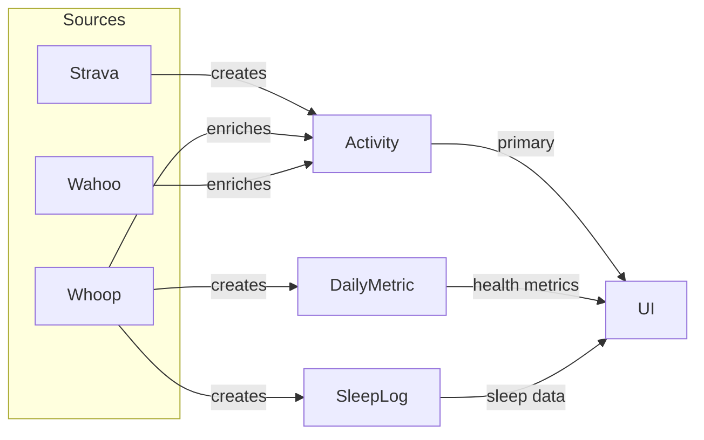

# Phase 5 — Whoop Integration (Complete)

> Created: 2026-08-17
> Status: Planning

Complete Whoop integration: recovery, sleep, workout enrichment, and dashboard display. Strava remains the source of truth for activities — Whoop data enriches existing Strava activities and provides daily health metrics.

---

## What Already Works

The existing codebase already queries [`DailyMetric`](backend/app/api/dashboard.py:79) and [`SleepLog`](backend/app/tasks/scheduler.py:140) for dashboard, health alerts, and weekly reports. Once Whoop data flows into these models, the following will **automatically populate** without frontend changes:

- **Dashboard**: latest recovery score, latest HRV
- **Dashboard**: weekly report (avg recovery, avg HRV, avg sleep hours)
- **Health alerts**: HRV decline, sleep decline detection (existing [`generate_health_alerts`](backend/app/tasks/scheduler.py:140) task)
- **Calendar**: activities are already shown per-day

## What Needs Building

The core sync is built (cycles → [`DailyMetric`](backend/app/services/whoop.py)). The remaining work is:

1. **Recovery sync** — enrich [`DailyMetric`](backend/app/models/daily_metric.py) with recovery_score, HRV, resting_hr, respiratory_rate
2. **Sleep sync** — populate [`SleepLog`](backend/app/models/sleep.py) from Whoop sleep data
3. **Workout enrichment** — match Whoop workouts to Strava activities (same pattern as [`sync_wahoo_activities`](backend/app/services/wahoo.py:80))
4. **Provider priority** — add `whoop` to [`PROVIDER_PRIORITY`](backend/app/services/merge_service.py:27)
5. **Dashboard strain** — add latest strain card
6. **Calendar** — add recovery/sleep badges to day detail
7. **Charts** — add strain trend chart

---

## Architecture

```mermaid
flowchart TB
    subgraph Whoop API
        CYCLES[/developer/v1/cycle]
        RECOVERY[/developer/v1/cycle/id/recovery]
        SLEEP[/developer/v1/activity/sleep]
        WORKOUT[/developer/v1/activity/workout]
    end

    subgraph Sync Services
        CS[whoop.py - cycle sync]
        RS[whoop.py - recovery sync]
        SS[whoop.py - sleep sync]
        WS[whoop.py - workout enrichment]
    end

    subgraph Models
        DM[DailyMetric]
        SL[SleepLog]
        ACT[Activity]
        ASRC[ActivitySource]
    end

    subgraph Consumers
        DASH[Dashboard]
        CAL[Calendar]
        ALERTS[Health Alerts]
        CHARTS[Charts]
    end

    CYCLES --> CS
    RECOVERY --> RS
    SLEEP --> SS
    WORKOUT --> WS

    CS --> DM
    RS --> DM
    SS --> SL
    WS --> ACT
    WS --> ASRC

    DM --> DASH
    DM --> ALERTS
    DM --> CHARTS
    SL --> DASH
    SL --> ALERTS
    ACT --> CAL
    ACT --> DASH
```

### Data Flow — Strava Source of Truth



**Merge priority**: Strava (3) > Wahoo (2) > Whoop (1) — Whoop data only fills gaps that Strava doesn't have.

---

## Work Items

### 1. WhoopClient — Add Recovery, Sleep, Workout Endpoints

**Goal**: Extend [`WhoopClient`](backend/app/integrations/whoop_client.py) with the remaining API endpoints.

These endpoints return 404 with the web app Cognito token but should work with the registered OAuth app token (which has `read:recovery`, `read:sleep`, `read:workout` scopes).

#### New Methods

```python
class WhoopClient:
    async def get_recovery_for_cycle(self, access_token, cycle_id) -> dict:
        """GET /developer/v1/cycle/{cycle_id}/recovery
        Returns: {"cycle_id": int, "recovery_score": float, "hrv_rmssd_milli": float,
                  "resting_heart_rate": int, "respiratory_rate": float, "spo2_percentage": float}
        """

    async def get_sleep_activities(self, access_token, start, end, limit=25) -> dict:
        """GET /developer/v1/activity/sleep
        Paginated. Returns: {"records": [...], "next_token": str}
        Each record: {"id": int, "start": str, "end": str, "score_state": str,
                      "score": {"total_sleep_time_milli": int, "sleep_efficiency": float,
                                "slow_wave_sleep_milli": int, "rem_sleep_milli": int,
                                "light_sleep_milli": int, "awake_time_milli": int}}
        """

    async def get_workout_activities(self, access_token, start, end, limit=25) -> dict:
        """GET /developer/v1/activity/workout
        Paginated. Returns: {"records": [...], "next_token": str}
        Each record: {"id": int, "start": str, "end": str, "sport_name": str,
                      "score_state": str, "score": {"strain": float, "average_heart_rate": int,
                      "max_heart_rate": int, "kilojoule": float}}
        """
```

#### Files

| File | Change |
|------|--------|
| [`backend/app/integrations/whoop_client.py`](backend/app/integrations/whoop_client.py) | Add `get_recovery_for_cycle()`, `get_sleep_activities()`, `get_workout_activities()` |

---

### 2. Whoop Recovery Sync — Enrich DailyMetric

**Goal**: For each synced cycle, fetch its recovery data and populate the empty [`DailyMetric`](backend/app/models/daily_metric.py) fields.

#### Approach

Update [`sync_whoop_cycles()`](backend/app/services/whoop.py) to also fetch recovery data after fetching cycles:

```python
# After fetching cycles, for each scored cycle:
recovery = await whoop_client.get_recovery_for_cycle(token, cycle_id)
# Update the DailyMetric with:
#   recovery_score = recovery.score.recovery_score  (0-100)
#   hrv_ms = recovery.score.hrv_rmssd_milli
#   resting_hr = recovery.score.resting_heart_rate
#   respiratory_rate = recovery.score.respiratory_rate
```

The upsert already handles updates — just add recovery fields to the `set_` clause.

#### Error Handling

- If recovery endpoint returns 404 for a cycle (recovery not computed yet), skip silently
- If recovery endpoint returns 401, the token is expired — raise ValueError
- Rate limit: add 100ms delay between recovery fetches (100 req/min limit)

#### Files

| File | Change |
|------|--------|
| [`backend/app/services/whoop.py`](backend/app/services/whoop.py) | Update [`sync_whoop_cycles()`](backend/app/services/whoop.py:103) to fetch recovery per cycle |

---

### 3. Whoop Sleep Sync — Populate SleepLog

**Goal**: Sync Whoop sleep data into the [`SleepLog`](backend/app/models/sleep.py) model.

#### Approach

Add [`sync_whoop_sleep()`](backend/app/services/whoop.py) to the whoop service:

```python
async def sync_whoop_sleep(db, user_id, limit=100) -> list[SleepLog]:
    """Fetch Whoop sleep data and upsert into SleepLog.

    For each sleep record:
    - sleep_date = record.start date
    - total_sleep_seconds = score.total_sleep_time_milli / 1000
    - deep_sleep_seconds = score.slow_wave_sleep_milli / 1000
    - rem_sleep_seconds = score.rem_sleep_milli / 1000
    - light_sleep_seconds = score.light_sleep_milli / 1000
    - awake_seconds = score.awake_time_milli / 1000
    - sleep_efficiency = score.sleep_efficiency
    - sleep_start = record.start
    - sleep_end = record.end
    - raw_data = full record

    Upsert on unique constraint (user_id, sleep_date, source='whoop').
    """
```

#### SleepLog Unique Constraint

The [`SleepLog`](backend/app/models/sleep.py) model doesn't have a unique constraint on `(user_id, sleep_date, source)`. We need to add one, or use a manual check-before-insert approach.

#### Files

| File | Change |
|------|--------|
| [`backend/app/services/whoop.py`](backend/app/services/whoop.py) | Add [`sync_whoop_sleep()`](backend/app/services/whoop.py) |
| [`backend/app/models/sleep.py`](backend/app/models/sleep.py) | Add unique constraint `(user_id, sleep_date, source)` — needs migration |

---

### 4. Whoop Workout Enrichment — Match to Strava Activities

**Goal**: Match Whoop workouts to existing Strava activities and enrich them. Same pattern as [`sync_wahoo_activities()`](backend/app/services/wahoo.py:80).

#### Approach

Add [`sync_whoop_workouts()`](backend/app/services/whoop.py):

```python
async def sync_whoop_workouts(db, user_id, limit=100) -> list[Activity]:
    """Enrich existing Strava activities with Whoop workout data.

    Strava is the source of truth. Whoop workouts are matched to existing
    Strava activities using the merge_service.find_duplicate_activity() algorithm:
    - Date proximity (50%)
    - Sport type (20%)
    - Duration (15%)
    - Distance (15%)

    If a match is found (score >= threshold), the Strava activity is enriched with:
    - Whoop strain score (stored in raw_data)
    - Whoop HR data (fills gaps if Strava doesn't have it)
    - Whoop calories (fills gaps)
    - ActivitySource record created for provenance

    If no match found, the Whoop workout is SKIPPED (not created standalone).
    """
```

#### Sport Type Mapping

```python
_WHOOP_SPORT_MAP = {
    "running": "running",
    "cycling": "cycling",
    "swimming": "swimming",
    "weightlifting": "strength",
    "strength_training": "strength",
    "yoga": "other",
    "walking": "walking",
    "hiking": "hiking",
}
```

#### Files

| File | Change |
|------|--------|
| [`backend/app/services/whoop.py`](backend/app/services/whoop.py) | Add [`sync_whoop_workouts()`](backend/app/services/whoop.py) |

---

### 5. Merge Service — Add Whoop Provider Priority

**Goal**: Add `whoop` to the provider priority map so merge conflicts are resolved correctly.

#### Approach

Update [`PROVIDER_PRIORITY`](backend/app/services/merge_service.py:27):

```python
PROVIDER_PRIORITY: dict[str, int] = {
    "strava": 3,
    "wahoo": 2,
    "whoop": 1,
    "manual": 0,
}
```

Whoop has the lowest priority because it typically has the least detailed activity data (no GPS, no power). Strava and Wahoo data is preferred.

#### Files

| File | Change |
|------|--------|
| [`backend/app/services/merge_service.py`](backend/app/services/merge_service.py) | Add `"whoop": 1` to `PROVIDER_PRIORITY` |

---

### 6. Connections API — Update Whoop Sync Handler

**Goal**: The [`trigger_sync()`](backend/app/api/connections.py) Whoop handler should sync all data types.

#### Approach

Update the Whoop branch in [`trigger_sync()`](backend/app/api/connections.py:116):

```python
elif connection.provider == "whoop":
    from app.services.whoop import sync_whoop_cycles, sync_whoop_sleep, sync_whoop_workouts
    cycles = await sync_whoop_cycles(db, current_user.id)
    sleep = await sync_whoop_sleep(db, current_user.id)
    workouts = await sync_whoop_workouts(db, current_user.id)
    await db.commit()
    return {
        "detail": f"Synced {len(cycles)} metrics, {len(sleep)} sleep records, {len(workouts)} enriched activities from Whoop",
        "synced_count": len(cycles) + len(sleep) + len(workouts),
    }
```

#### Files

| File | Change |
|------|--------|
| [`backend/app/api/connections.py`](backend/app/api/connections.py) | Update Whoop sync handler to include sleep + workout sync |

---

### 7. Celery Beat — Update Whoop Sync Task

**Goal**: Update [`sync_all_whoop_cycles`](backend/app/tasks/scheduler.py:408) to sync all data types.

#### Approach

Rename to `sync_all_whoop_data` and add sleep + workout sync:

```python
@celery_app.task(name="app.tasks.scheduler.sync_all_whoop_data")
def sync_all_whoop_data() -> dict:
    """Sync all Whoop data for connected users: cycles, recovery, sleep, workouts."""
    # For each user with Whoop connection:
    #   1. sync_whoop_cycles (includes recovery enrichment)
    #   2. sync_whoop_sleep
    #   3. sync_whoop_workouts (enriches Strava activities)
```

Update beat schedule entry to use new task name.

#### Files

| File | Change |
|------|--------|
| [`backend/app/tasks/scheduler.py`](backend/app/tasks/scheduler.py) | Rename task, add sleep + workout sync |

---

### 8. Dashboard — Strain Card

**Goal**: Add a Whoop strain summary card to the dashboard.

#### Approach

1. **[`DashboardSummary`](backend/app/schemas/dashboard.py)**: Add `latest_strain: float | None = None`
2. **[`dashboard_summary()`](backend/app/api/dashboard.py)**: Query latest strain from `DailyMetric`
3. **Frontend**: Add strain card alongside existing recovery card

#### Files

| File | Change |
|------|--------|
| [`backend/app/schemas/dashboard.py`](backend/app/schemas/dashboard.py) | Add `latest_strain` field |
| [`backend/app/api/dashboard.py`](backend/app/api/dashboard.py) | Query latest strain |
| [`frontend/src/app/(app)/dashboard/page.tsx`](frontend/src/app/(app)/dashboard/page.tsx) | Add strain summary card |

---

### 9. Calendar — Recovery/Sleep Badges

**Goal**: Show Whoop recovery and sleep data on calendar day detail.

#### Approach

The calendar page already fetches activities per day. Add:
- Recovery score badge (green/yellow/red based on score)
- Sleep duration badge
- Strain badge

These come from [`DailyMetric`](backend/app/models/daily_metric.py) which is already populated by Whoop sync.

Add a `GET /api/v1/activities/calendar` endpoint that returns both activities AND daily metrics for the date range, so the calendar can show health data alongside activities.

#### Files

| File | Change |
|------|--------|
| [`backend/app/api/activities.py`](backend/app/api/activities.py) | Add calendar endpoint with daily metrics |
| [`frontend/src/app/(app)/calendar/page.tsx`](frontend/src/app/(app)/calendar/page.tsx) | Show recovery/sleep/strain badges on day cells |

---

### 10. Charts — Strain Trend

**Goal**: Add a Whoop strain trend chart.

#### Approach

Add to [`ChartService`](backend/app/services/charts.py):

```python
async def whoop_strain_trend(self, days: int = 30) -> ChartData:
    """Daily strain score over time from Whoop cycles.
    Bar chart with strain values, colored by intensity (low/moderate/high)."""
```

#### Files

| File | Change |
|------|--------|
| [`backend/app/services/charts.py`](backend/app/services/charts.py) | Add `whoop_strain_trend()` |
| [`backend/app/api/charts.py`](backend/app/api/charts.py) | Add endpoint for strain trend |

---

## Files Summary

| File | Change | Work Item |
|------|--------|-----------|
| [`backend/app/integrations/whoop_client.py`](backend/app/integrations/whoop_client.py) | Add recovery, sleep, workout endpoints | 1 |
| [`backend/app/services/whoop.py`](backend/app/services/whoop.py) | Add recovery enrichment, sleep sync, workout enrichment | 2, 3, 4 |
| [`backend/app/services/merge_service.py`](backend/app/services/merge_service.py) | Add `whoop: 1` to provider priority | 5 |
| [`backend/app/api/connections.py`](backend/app/api/connections.py) | Update Whoop sync handler (all data types) | 6 |
| [`backend/app/tasks/scheduler.py`](backend/app/tasks/scheduler.py) | Update Whoop beat task (all data types) | 7 |
| [`backend/app/schemas/dashboard.py`](backend/app/schemas/dashboard.py) | Add `latest_strain` | 8 |
| [`backend/app/api/dashboard.py`](backend/app/api/dashboard.py) | Query latest strain | 8 |
| [`frontend/src/app/(app)/dashboard/page.tsx`](frontend/src/app/(app)/dashboard/page.tsx) | Add strain card | 8 |
| [`backend/app/api/activities.py`](backend/app/api/activities.py) | Calendar endpoint with daily metrics | 9 |
| [`frontend/src/app/(app)/calendar/page.tsx`](frontend/src/app/(app)/calendar/page.tsx) | Recovery/sleep badges | 9 |
| [`backend/app/services/charts.py`](backend/app/services/charts.py) | Add strain trend chart | 10 |
