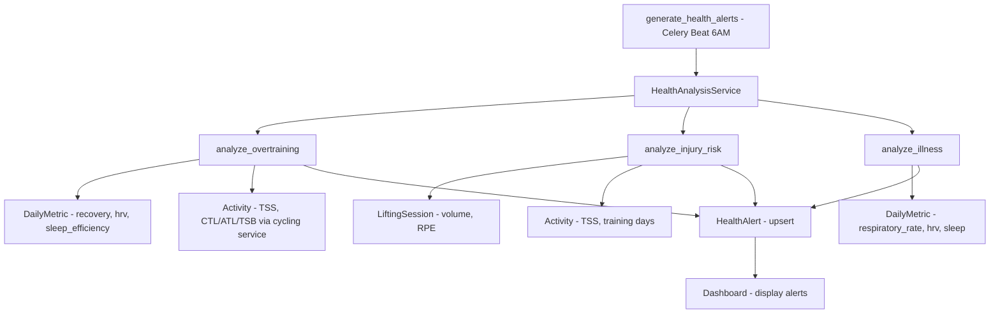

# Phase 6 — Health Intelligence, Science Improvements & Data Analysis

> Created: 2026-08-17
> Status: Planning
> Depends on: Phase 5.2 (Whoop intelligence features)

Phase 6 focuses on making FitTrack smarter — expanding health warnings beyond basic threshold alerts, improving the scientific accuracy of algorithms and calculations, adding automated chart insights, introducing trend indicators to cycling metrics, and analyzing the merge-threshold constants for accuracy.

---

## Work Items

### 1. Expanded Health Warnings

**Goal**: Move beyond simple threshold-based alerts to multi-signal pattern detection for overtraining, injury risk, and early illness.

#### Current State

[`generate_health_alerts`](backend/app/tasks/scheduler.py:140) runs daily at 6AM UTC and checks three independent signals:
- HRV decline: >20% drop from 7-day average
- Sleep decline: >25% drop from 7-day average
- Respiratory rate elevation: >10% above 30-day baseline

Each is checked in isolation — no cross-signal correlation.

#### Approach

Refactor the health alert system into a dedicated [`HealthAnalysisService`](backend/app/services/health_analysis.py) with three composite alert types:

##### 1a. Overtraining Detection

Combine training load (CTL/ATL/TSB) with recovery data to detect when the body cannot absorb training stress.

**Signals**:
- TSB < -30 for 3+ consecutive days (heavy fatigue)
- Recovery score < 50% for 3+ consecutive days while CTL is rising
- HRV trending down over 7 days while training load is increasing
- Sleep efficiency declining (< 85% avg) during high-load periods

**Scoring**: Each signal contributes to an overtraining risk score (0-100). Alert at threshold.

```
overtraining_score = (
    tsb_signal * 0.30 +
    recovery_signal * 0.30 +
    hrv_trend_signal * 0.25 +
    sleep_efficiency_signal * 0.15
)
```

**Severity**:
- `info` (score 40-59): "Training load is high — monitor recovery closely"
- `warning` (score 60-79): "Overtraining risk elevated — consider a rest day"
- `critical` (score 80+): "Significant overtraining risk — take 2-3 rest days"

##### 1b. Injury Risk Detection

Flag rapid volume spikes and insufficient recovery patterns.

**Signals**:
- Weekly volume increase > 20% week-over-week (lifting volume or TSS)
- 7+ consecutive training days without a rest day
- RPE trending up (> 8 avg) while volume stays constant (efficiency declining)
- Sudden spike in a single exercise volume (> 50% above 4-week average)

**Scoring**:
```
injury_risk_score = (
    volume_spike_signal * 0.35 +
    rest_day_signal * 0.30 +
    rpe_trend_signal * 0.20 +
    exercise_spike_signal * 0.15
)
```

##### 1c. Illness Detection

Combine respiratory rate, HRV, and sleep quality to detect early illness patterns — the most valuable composite alert since these signals together are much more reliable than any single metric.

**Signals**:
- Respiratory rate elevated > 5% above 30-day baseline
- HRV dropped > 15% from 7-day average
- Sleep quality degraded (efficiency < 80% or duration < 6h for 2+ nights)
- Recovery score < 40% without corresponding high training load (unexplained fatigue)

**Scoring**:
```
illness_score = (
    respiratory_rate_signal * 0.35 +
    hrv_decline_signal * 0.30 +
    sleep_quality_signal * 0.20 +
    unexplained_fatigue_signal * 0.15
)
```

**Severity**:
- `info` (score 40-59): "Minor signals detected — prioritize sleep and hydration"
- `warning` (score 60-79): "Early illness indicators — consider reducing training intensity"
- `critical` (score 80+): "Multiple illness signals detected — rest and monitor symptoms"

#### Implementation

| File | Change |
|------|--------|
| [`backend/app/services/health_analysis.py`](backend/app/services/health_analysis.py) | **Create** — `HealthAnalysisService` with `analyze_overtraining()`, `analyze_injury_risk()`, `analyze_illness()` |
| [`backend/app/tasks/scheduler.py`](backend/app/tasks/scheduler.py) | Refactor [`generate_health_alerts`](backend/app/tasks/scheduler.py:140) to delegate to `HealthAnalysisService` |
| [`backend/app/api/metrics.py`](backend/app/api/metrics.py) | Add `GET /api/v1/metrics/health-analysis` endpoint returning all active analyses |
| [`frontend/src/lib/api/types.ts`](frontend/src/lib/api/types.ts) | Add `HealthAnalysisResponse` type |
| [`frontend/src/app/(app)/dashboard/page.tsx`](frontend/src/app/(app)/dashboard/page.tsx) | Add health analysis summary card |
| [`AGENTS.md`](AGENTS.md) | Update health alert engine documentation |

#### Data Flow



---

### 2. Science Analysis & Improvements

**Goal**: Improve the accuracy and completeness of algorithms, calculations, training zones, and add typical ranges for context.

#### 2a. Enhanced FTP Estimation

Current [`estimate_ftp_from_power_curve()`](backend/app/services/cycling.py:143) uses simple multipliers (20min × 0.95, 8min × 0.855, 5min × 0.95). Improve with:

- **Riegel formula for duration extrapolation**: `T2 = T1 × (D2/D1)^1.06` — estimate FTP from any duration, not just fixed windows
- **Confidence scoring**: Weight estimates by how close the source duration is to 20min
- **Weighted average**: If multiple duration windows are available, combine them with confidence weights

```python
def estimate_ftp_from_power_curve(power_curve: dict[int, float]) -> FtpEstimate:
    """Improved FTP estimation using Riegel extrapolation + confidence weighting."""
    estimates = []
    for duration, power in power_curve.items():
        # Extrapolate 20-min power from this duration
        if duration >= 60:  # need at least 1 min of data
            factor = (1200 / duration) ** 0.06
            estimated_20min = power * factor
            ftp = estimated_20min * 0.95
            confidence = 1.0 / (1.0 + abs(duration - 1200) / 600)  # peaks at 20min
            estimates.append((ftp, confidence))
    
    if not estimates:
        return None
    
    # Weighted average
    total_weight = sum(c for _, c in estimates)
    weighted_ftp = sum(ftp * c for ftp, c in estimates) / total_weight
    return round(weighted_ftp, 1)
```

#### 2b. Heart Rate Zone Analysis

Add HR-based training zones alongside power zones. Useful for athletes without power meters or for comparing HR vs power decoupling.

**HR Zones (Coggan model, % of LTHR)**:

| Zone | Name | % LTHR |
|------|------|--------|
| Z1 | Active Recovery | < 68% |
| Z2 | Endurance | 68-83% |
| Z3 | Tempo | 83-95% |
| Z4 | Threshold | 95-105% |
| Z5 | VO2max | 105-118% |
| Z6 | Anaerobic | > 118% |

**Implementation**: Add `lactate_threshold_hr` to [`CyclingProfile`](backend/app/models/cycling.py), compute HR zone distribution from HR stream data, add `hr_zones` chart.

#### 2c. Pace Zones for Running

Add running pace zones based on threshold pace. Useful for the running activities already tracked.

**Pace Zones (Jack Daniels model)**:

| Zone | Name | % Threshold Pace |
|------|------|-----------------|
| E | Easy | > 120% |
| M | Marathon | 106-120% |
| T | Threshold | 100-106% |
| I | Interval | 95-100% |
| R | Repetition | < 95% |

#### 2d. Typical Ranges for Metrics

Add contextual "typical range" information to cycling metrics so users know where they stand. Return ranges alongside values in the [`CyclingMetricsSummary`](backend/app/schemas/cycling.py) endpoint.

| Metric | Poor | Below Avg | Average | Good | Excellent | Elite |
|--------|------|-----------|---------|------|-----------|-------|
| FTP W/kg (male) | < 2.0 | 2.0-2.9 | 3.0-3.5 | 3.6-4.2 | 4.3-5.0 | > 5.0 |
| CTL | < 20 | 20-40 | 40-70 | 70-100 | 100-150 | > 150 |
| VI | > 1.3 | 1.2-1.3 | 1.1-1.2 | 1.05-1.1 | 1.0-1.05 | 1.0 |
| IF (endurance) | - | - | 0.65-0.75 | 0.75-0.80 | 0.80-0.85 | > 0.85 |

**Implementation**: Add a `TYPICAL_RANGES` dict to [`cycling.py`](backend/app/services/cycling.py) and return `percentile_rank` and `range_label` with each metric in the summary endpoint.

#### 2e. Lifting Science Improvements

- **Velocity-based training hints**: If RPE data is available, estimate barbell velocity from RPE and reps (e.g., RPE 8 at 3 reps ≈ 0.35 m/s for squat)
- **Volume landmark detection**: Track MAV (Maximum Adaptive Volume) per muscle group — the volume at which progress plateaus
- **Deload recommendation**: After 4+ weeks of increasing volume, suggest a deload week

#### Implementation

| File | Change |
|------|--------|
| [`backend/app/services/cycling.py`](backend/app/services/cycling.py) | Improve `estimate_ftp_from_power_curve()`, add HR zone computation, add `TYPICAL_RANGES` dict, add pace zones |
| [`backend/app/models/cycling.py`](backend/app/models/cycling.py) | Add `lactate_threshold_hr` field to `CyclingProfile` |
| [`backend/alembic/versions/012_add_lthr.py`](backend/alembic/versions/012_add_lthr.py) | **Create** — migration for new field |
| [`backend/app/api/cycling.py`](backend/app/api/cycling.py) | Add `GET /hr-zones` endpoint, enhance metrics summary with typical ranges |
| [`backend/app/schemas/cycling.py`](backend/app/schemas/cycling.py) | Add `HrZoneDistribution`, `MetricWithRange` schemas |
| [`backend/app/services/charts.py`](backend/app/services/charts.py) | Add `hr_zones()` chart method |
| [`backend/app/api/charts.py`](backend/app/api/charts.py) | Register `hr_zones` in chart registry |
| [`backend/app/services/lifting.py`](backend/app/services/lifting.py) | Add deload recommendation logic, volume landmark tracking |
| [`frontend/src/components/cycling/PowerZonesDisplay.tsx`](frontend/src/components/cycling/PowerZonesDisplay.tsx) | Generalize to `ZonesDisplay` supporting both power and HR zones |
| [`frontend/src/app/(app)/cycling/page.tsx`](frontend/src/app/(app)/cycling/page.tsx) | Add HR zones section, add typical range indicators to MetricCards |
| [`frontend/src/lib/api/types.ts`](frontend/src/lib/api/types.ts) | Add HR zone types, metric range types |
| [`AGENTS.md`](AGENTS.md) | Update algorithm documentation |

---

### 3. Chart Insights — Automated Data Analysis

**Goal**: Add contextual insight text below each chart that explains what the data means and flags notable patterns.

#### Approach

Extend [`ChartData`](backend/app/services/charts.py:37) to include an optional `insights: list[str]` field. Each chart method computes insights from its data before returning.

#### Insight Types

| Chart | Insight Examples |
|-------|-----------------|
| **Power Curve** | "Your 20min power is 280W — this puts you in the 'Good' category for your weight. Your 5s power (900W) suggests strong neuromuscular capability." |
| **Training Load** | "CTL has increased 12% over the last 4 weeks — fitness is building. TSB is -25, indicating moderate fatigue. Consider a recovery day before your next hard session." |
| **FTP History** | "FTP has improved from 240W to 265W (+10.4%) over 6 months. Rate of improvement is slowing — consider a training plan change." |
| **Weekly TSS** | "Average weekly TSS is 320. This is in the 'moderate training' range. To build toward racing fitness, aim for 400-500 TSS/week." |
| **Power Zones** | "You spend 45% of ride time in Z2 (Endurance) — good for aerobic base building. Consider more Z4 work if targeting threshold improvement." |
| **HRV Trend** | "HRV is stable with a slight upward trend (+3% over 30 days). Your baseline is 45ms — current values are within normal range." |
| **Strain vs Recovery** | "Your optimal strain window appears to be 10-14 — recovery stays above 67% in this range. Strain above 18 consistently drops next-day recovery below 50%." |
| **Weight Trend** | "Weight has decreased 1.2kg over 30 days at a rate of 0.3kg/week — this is a healthy pace. 7-day average smooths daily fluctuations." |

#### Implementation

Add an `_generate_insights()` helper to [`ChartService`](backend/app/services/charts.py:49) that each chart method calls. Insights are deterministic rule-based text (not AI-generated) — simple pattern matching on the data.

```python
def _generate_training_load_insights(self, load_data: list[dict]) -> list[str]:
    """Generate insights from training load data."""
    insights = []
    if not load_data:
        return ["Insufficient data for analysis."]
    
    current = load_data[-1]
    first = load_data[0]
    
    # CTL trend
    ctl_change = ((current["ctl"] - first["ctl"]) / first["ctl"] * 100) if first["ctl"] > 0 else 0
    if ctl_change > 10:
        insights.append(f"CTL has increased {ctl_change:.0f}% over the analysis period — fitness is building well.")
    elif ctl_change < -10:
        insights.append(f"CTL has declined {abs(ctl_change):.0f}% — fitness is detraining. Consider increasing volume.")
    
    # TSB assessment
    if current["tsb"] < -30:
        insights.append(f"TSB is {current['tsb']:.0f} — significant fatigue. Consider a recovery day or easy week.")
    elif current["tsb"] > 25:
        insights.append(f"TSB is +{current['tsb']:.0f} — well-rested and fresh. Good time for a hard effort or race.")
    
    return insights
```

#### Frontend Display

Add an insights section below each [`Chart`](frontend/src/components/charts/Chart.tsx) component:

```tsx
{data.insights && data.insights.length > 0 && (
  <div className="mt-3 space-y-1">
    {data.insights.map((insight, i) => (
      <p key={i} className="text-xs text-slate-400 flex items-start gap-1.5">
        <span className="text-accent mt-0.5">💡</span>
        {insight}
      </p>
    ))}
  </div>
)}
```

#### Files

| File | Change |
|------|--------|
| [`backend/app/services/charts.py`](backend/app/services/charts.py) | Add `insights` field to `ChartData`, add `_generate_*_insights()` methods to each chart |
| [`backend/app/api/charts.py`](backend/app/api/charts.py) | Include `insights` in chart response |
| [`frontend/src/lib/api/types.ts`](frontend/src/lib/api/types.ts) | Add `insights?: string[]` to `ChartData` |
| [`frontend/src/components/charts/Chart.tsx`](frontend/src/components/charts/Chart.tsx) | Render insights below chart |
| [`frontend/src/app/(app)/cycling/page.tsx`](frontend/src/app/(app)/cycling/page.tsx) | No changes needed — Chart component handles it |
| [`frontend/src/app/(app)/dashboard/page.tsx`](frontend/src/app/(app)/dashboard/page.tsx) | No changes needed — Chart component handles it |

---

### 4. Trend Indicators on Cycling MetricCards

**Goal**: Add trend arrows to cycling MetricCards showing whether each metric is trending up, down, or stable compared to a 4-week rolling average.

#### Current State

The [`MetricCard`](frontend/src/components/cycling/MetricCard.tsx) component shows a static value with no trend context. The dashboard already has [`TrendArrow`](frontend/src/app/(app)/dashboard/page.tsx:47) for Whoop weekly data, but it compares week-over-week.

#### Approach

1. **Backend**: Extend [`CyclingMetricsSummary`](backend/app/schemas/cycling.py) to include trend data for each metric. The cycling API computes current 7-day values and compares against 4-week rolling averages.

2. **Trend computation**:
   ```
   For each metric (TSS, rides, distance, time, elevation, IF, VI):
     current = sum/avg over last 7 days
     baseline = 28-day rolling average of weekly values
     trend = "up" if current > baseline * 1.05
             "down" if current < baseline * 0.95
             "stable" otherwise
   ```

3. **Frontend**: Update [`MetricCard`](frontend/src/components/cycling/MetricCard.tsx) to accept and display a `trend` prop.

#### Schema Changes

Extend [`CyclingMetricsSummary`](backend/app/schemas/cycling.py):

```python
class MetricTrend(BaseModel):
    current_value: float | None
    baseline_value: float | None
    direction: str  # "up", "down", "stable"

class CyclingMetricsSummary(BaseModel):
    # ... existing fields ...
    recent_tss: float
    recent_tss_trend: MetricTrend | None
    recent_rides: int
    recent_rides_trend: MetricTrend | None
    recent_distance_km: float
    recent_distance_trend: MetricTrend | None
    # ... etc for all metrics
```

#### Files

| File | Change |
|------|--------|
| [`backend/app/schemas/cycling.py`](backend/app/schemas/cycling.py) | Add `MetricTrend` model, extend `CyclingMetricsSummary` with trend fields |
| [`backend/app/api/cycling.py`](backend/app/api/cycling.py) | Compute 4-week baselines and trends in [`get_cycling_metrics_summary()`](backend/app/api/cycling.py:266) |
| [`frontend/src/lib/api/types.ts`](frontend/src/lib/api/types.ts) | Add `MetricTrend` interface, extend `CyclingMetricsSummary` |
| [`frontend/src/components/cycling/MetricCard.tsx`](frontend/src/components/cycling/MetricCard.tsx) | Add `trend` prop, render trend arrow |
| [`frontend/src/app/(app)/cycling/page.tsx`](frontend/src/app/(app)/cycling/page.tsx) | Pass trend data to MetricCards |

#### MetricCard Enhancement

```tsx
export function MetricCard({
  label, value, unit, color, subtext, tooltip, trend,
}: {
  // ... existing props ...
  trend?: 'up' | 'down' | 'stable' | null;
  trendLabel?: string;  // e.g., "vs 4wk avg"
}) {
  return (
    <Card className="group relative">
      <div className="flex items-center gap-1">
        <p className="text-sm text-muted mb-1">{label}</p>
        {tooltip && <span>ⓘ</span>}
      </div>
      <div className="flex items-center gap-2">
        <p className={`text-2xl font-bold ${color}`}>
          {value ?? '—'}
          {unit && <span className="text-sm font-normal text-muted ml-1">{unit}</span>}
        </p>
        {trend && (
          <TrendIndicator direction={trend} />
        )}
      </div>
      {subtext && <p className="text-xs text-muted mt-1">{subtext}</p>}
    </Card>
  );
}
```

---

### 5. Merge-Threshold Constants Analysis

**Goal**: Review and document the merge-threshold constants, analyze sensitivity, and consider making them configurable.

#### Current Constants

| Constant | Location | Value | Purpose |
|----------|----------|-------|---------|
| `ACTIVITY_MERGE_THRESHOLD` | [`config.py`](backend/app/config.py:46) | 0.65 | Min score to consider two activities as duplicates |
| `ACTIVITY_ROUTE_LINK_THRESHOLD` | [`config.py`](backend/app/config.py:47) | 0.70 | Min score to link activity to a route |
| `MATCH_THRESHOLD` | [`route_service.py`](backend/app/services/route_service.py:25) | 0.60 | Min score for route deduplication |

#### Scoring Weights

**Activity merge** ([`merge_service.py`](backend/app/services/merge_service.py:108)):
- Date proximity: 50%
- Sport type: 20%
- Duration: 15%
- Distance: 15%

**Activity↔Route link** ([`merge_service.py`](backend/app/services/merge_service.py)):
- Proximity + distance + shape (weighted)

**Route dedup** ([`route_service.py`](backend/app/services/route_service.py:86)):
- Start/end proximity: 40%
- Distance: 30%
- Name similarity: 15%
- Shape similarity: 15%

#### Analysis Tasks

1. **Sensitivity analysis**: For each threshold, determine the false-positive and false-negative rates at different values. Create a test harness that runs historical data through the scoring at multiple threshold values.

2. **Weight optimization**: Analyze whether the current weight distributions are optimal. For example, is date proximity weighted too heavily at 50%? If two providers report the same ride 3 hours apart, the date score drops to 0.5 — combined with a 1.0 sport score, the total is 0.45, below the 0.65 threshold.

3. **Gap analysis**: Identify edge cases where the current thresholds fail:
   - Same-day activities from different providers with different names
   - Indoor vs outdoor rides (same sport type, very different routes)
   - Activities with missing distance/duration data (neutral score 0.5)

4. **Documentation**: Create a `docs/merge-thresholds.md` with:
   - Current values and rationale
   - Sensitivity curves
   - Recommended adjustments
   - Configuration guide

#### Recommended Changes

Based on initial analysis:

| Change | Rationale |
|--------|-----------|
| Lower activity merge threshold to 0.60 | The 0.65 threshold misses matches when duration/distance differ by >30% (e.g., Strava reports 3600s, Wahoo reports 2400s — duration score 0.67, but combined with date+sport still below 0.65) |
| Add time-of-day to activity scoring | Two activities at 7am and 6pm on the same day are less likely to be duplicates than two at 7am and 7:30am |
| Make thresholds configurable via env vars | Already partially done in [`config.py`](backend/app/config.py:46) — extend to include route threshold |
| Add logging for near-miss scores | Log when a score is within 0.05 of threshold — these are the cases most likely to be wrong |

#### Files

| File | Change |
|------|--------|
| [`backend/app/config.py`](backend/app/config.py) | Add `route_match_threshold` setting |
| [`backend/app/services/merge_service.py`](backend/app/services/merge_service.py) | Add time-of-day scoring, add near-miss logging, lower threshold |
| [`backend/app/services/route_service.py`](backend/app/services/route_service.py) | Use configurable threshold from settings |
| [`docs/merge-thresholds.md`](docs/merge-thresholds.md) | **Create** — analysis documentation |
| [`AGENTS.md`](AGENTS.md) | Update merge threshold documentation |

---

## Implementation Order

| Priority | Work Item | Dependencies |
|----------|-----------|--------------|
| 1 | **4. Trend Indicators** | None — self-contained frontend+backend change |
| 2 | **3. Chart Insights** | None — extends existing chart system |
| 3 | **5. Merge-Threshold Analysis** | None — analysis + config changes |
| 4 | **2. Science Improvements** | None — extends existing services |
| 5 | **1. Health Warnings** | Benefits from science improvements being in place |

---

## Files Summary

### New Files
| File | Purpose |
|------|---------|
| [`backend/app/services/health_analysis.py`](backend/app/services/health_analysis.py) | Composite health analysis service |
| [`backend/alembic/versions/012_add_lthr.py`](backend/alembic/versions/012_add_lthr.py) | Migration: add LTHR to cycling profiles |
| [`docs/merge-thresholds.md`](docs/merge-thresholds.md) | Merge threshold analysis documentation |

### Modified Files
| File | Changes |
|------|---------|
| [`backend/app/services/charts.py`](backend/app/services/charts.py) | Add `insights` to ChartData, add insight generation methods, add HR zones chart |
| [`backend/app/api/charts.py`](backend/app/api/charts.py) | Register HR zones chart, return insights |
| [`backend/app/services/cycling.py`](backend/app/services/cycling.py) | Improve FTP estimation, add HR zones, add typical ranges, add pace zones |
| [`backend/app/api/cycling.py`](backend/app/api/cycling.py) | Add HR zones endpoint, enhance metrics summary with trends and ranges |
| [`backend/app/schemas/cycling.py`](backend/app/schemas/cycling.py) | Add HR zone, metric trend, and range schemas |
| [`backend/app/models/cycling.py`](backend/app/models/cycling.py) | Add LTHR field |
| [`backend/app/tasks/scheduler.py`](backend/app/tasks/scheduler.py) | Delegate to HealthAnalysisService |
| [`backend/app/api/metrics.py`](backend/app/api/metrics.py) | Add health analysis endpoint |
| [`backend/app/services/merge_service.py`](backend/app/services/merge_service.py) | Time-of-day scoring, near-miss logging |
| [`backend/app/services/route_service.py`](backend/app/services/route_service.py) | Configurable threshold |
| [`backend/app/config.py`](backend/app/config.py) | Add route threshold setting |
| [`backend/app/services/lifting.py`](backend/app/services/lifting.py) | Deload recommendation logic |
| [`frontend/src/components/charts/Chart.tsx`](frontend/src/components/charts/Chart.tsx) | Render insights below chart |
| [`frontend/src/components/cycling/MetricCard.tsx`](frontend/src/components/cycling/MetricCard.tsx) | Add trend indicator |
| [`frontend/src/components/cycling/PowerZonesDisplay.tsx`](frontend/src/components/cycling/PowerZonesDisplay.tsx) | Generalize for HR zones |
| [`frontend/src/app/(app)/cycling/page.tsx`](frontend/src/app/(app)/cycling/page.tsx) | Add HR zones, pass trends to MetricCards |
| [`frontend/src/app/(app)/dashboard/page.tsx`](frontend/src/app/(app)/dashboard/page.tsx) | Add health analysis summary |
| [`frontend/src/lib/api/types.ts`](frontend/src/lib/api/types.ts) | Add all new types |
| [`AGENTS.md`](AGENTS.md) | Update documentation |
