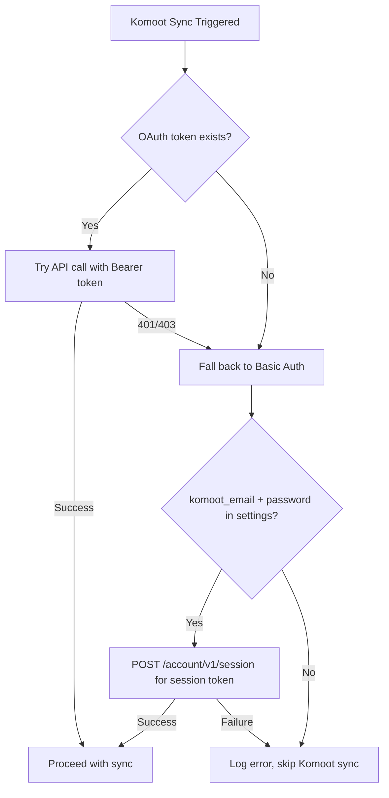
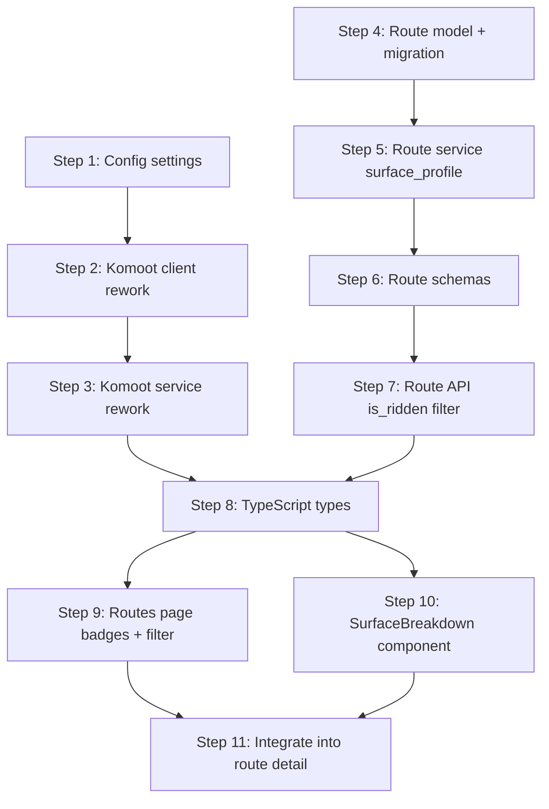

# Phase 7 — Komoot Integration Rework & Routes Hub

## Goals

1. **Rework Komoot client** to use the reverse-engineered internal API (`v007`) with Basic Auth fallback
2. **Enrich route data** with surface/terrain breakdown and per-trackpoint coordinate streams
3. **Differentiate ridden vs unridden routes** with badges and filter toggle on the routes page
4. **Surface Komoot-only planned routes** that don't exist on other providers

## Scope

| In Scope | Out of Scope |
|----------|-------------|
| Basic Auth fallback for Komoot | Komoot routing engine |
| `/tours/{id}/coordinates` endpoint | `/tours/{id}/highlights` (POIs, photos) |
| `/tours/{id}/surface` endpoint | `/tours/{id}.gpx` (we already export GPX) |
| Surface breakdown UI (stacked bar) | `/routing/v2/surfaces` |
| Ridden/unridden badges + filter | |
| Komoot route type in raw_data | |

---

## Architecture

### Auth Strategy



- **Primary**: Keep existing OAuth flow unchanged — if user has a valid Komoot OAuthConnection, use it
- **Fallback**: If OAuth fails or doesn't exist, use `komoot_email` + `komoot_password` from settings to authenticate via `POST /account/v1/session`
- **Session management**: Store session token in memory (not DB) with expiry. Re-auth as needed.
- **Required headers**: `User-Agent` (to avoid Cloudflare blocking), `Accept: application/hal+json`

### Data Flow

```mermaid
flowchart LR
    subgraph Komoot API v007
        T1[/users/user_id/tours]
        T2[/tours/tour_id/coordinates]
        T3[/tours/tour_id/surface]
        R1[/users/user_id/routes]
    end

    subgraph Backend
        KC[KomootClient] --> KS[KomootService]
        KS --> RS[RouteService]
        RS --> DB[(PostgreSQL)]
    end

    T1 --> KC
    T2 --> KC
    T3 --> KC
    R1 --> KC
    DB --> API[Routes API]
    API --> FE[Routes Page]
```

---

## Backend Implementation

### Step 1: Config — Add Basic Auth Settings

**File**: [`backend/app/config.py`](backend/app/config.py:1)

Add two new settings:
- `komoot_email: str = ""`
- `komoot_password: str = ""`

These are used as fallback when OAuth is unavailable.

### Step 2: Rework Komoot Client

**File**: [`backend/app/integrations/komoot_client.py`](backend/app/integrations/komoot_client.py:17)

Changes:
- Update base URL constant: `KOMOOT_API_BASE = "https://api.komoot.de/v007"` (note: `v007` not `v0.07`)
- Add `_session_token: str | None` instance variable for Basic Auth sessions
- Add `_get_headers()` helper that returns:
  - `Authorization: Bearer {token}` (OAuth) or `Authorization: Basic {base64(email:password)}` (Basic Auth)
  - `User-Agent: Mozilla/5.0 ...` (browser-like UA to avoid Cloudflare)
  - `Accept: application/hal+json`
- Add `authenticate_basic()` method: `POST /account/v1/session` with email/password, stores session token
- Update all existing methods (`get_tours`, `get_tour_detail`, `get_routes`, `get_route_detail`) to use `_get_headers()`
- Add new method `get_coordinates(access_token, user_id, tour_id) -> list[dict]`:
  - `GET /tours/{tour_id}/coordinates`
  - Returns array of `{lat, lng, alt, t}` trackpoints
- Add new method `get_surface(access_token, user_id, tour_id) -> dict`:
  - `GET /tours/{tour_id}/surface`
  - Returns terrain type breakdown (asphalt, gravel, singletrack, etc.)
- Add auth fallback logic: method `ensure_authenticated()` that tries OAuth first, falls back to Basic Auth

### Step 3: Rework Komoot Service

**File**: [`backend/app/services/komoot.py`](backend/app/services/komoot.py:106)

Changes to [`sync_komoot_routes()`](backend/app/services/komoot.py:106):
- Call `komoot_client.ensure_authenticated()` at start of sync
- For each tour, after extracting the polyline:
  - Call `komoot_client.get_coordinates()` — if richer than current polyline, use it to build a higher-fidelity polyline
  - Call `komoot_client.get_surface()` — store result
- Store Komoot route type (`planned` vs `recorded`) in the `raw_data` dict passed to `create_or_merge_route()`
- Pass `surface_data` to `create_or_merge_route()` so it gets saved to the Route

New helper `_extract_surface_profile(surface_data: dict) -> dict | None`:
- Normalize the Komoot surface response into a clean `{asphalt: 0.6, gravel: 0.25, ...}` dict
- Return None if the surface data is empty or malformed

### Step 4: Route Model — Add surface_profile Column

**File**: [`backend/app/models/route.py`](backend/app/models/route.py:11)

Add to `Route` class:
```
surface_profile: Mapped[dict | None] = mapped_column(JSONB, nullable=True)
```

**New migration**: `014_add_surface_profile.py`
- Add `surface_profile JSONB NULL` to `routes` table

### Step 5: Route Service — Accept surface_profile

**File**: [`backend/app/services/route_service.py`](backend/app/services/route_service.py:245)

Update [`create_or_merge_route()`](backend/app/services/route_service.py:245) signature:
- Add `surface_profile: dict | None = None` parameter
- Pass it through to [`create_route()`](backend/app/services/route_service.py:161)

Update [`create_route()`](backend/app/services/route_service.py:161):
- Accept and store `surface_profile` on the Route object

### Step 6: Route Schemas — Add New Fields

**File**: [`backend/app/schemas/route.py`](backend/app/schemas/route.py:1)

Update [`RouteRead`](backend/app/schemas/route.py:24):
- Add `surface_profile: dict | None = None`

Update [`RouteSummary`](backend/app/schemas/route.py:47):
- Add `surface_profile: dict | None = None`
- Add `is_ridden: bool = False` (computed from `ride_count > 0`)

Update [`RouteSourceRead`](backend/app/schemas/route.py:11):
- No schema change needed — Komoot type stored in `raw_data` JSONB which isn't exposed in the summary

### Step 7: Route API — Add is_ridden Filter

**File**: [`backend/app/api/routes.py`](backend/app/api/routes.py:48)

Update [`list_routes()`](backend/app/api/routes.py:48):
- Add `is_ridden: bool | None = Query(None)` parameter
- When `is_ridden=False`: filter to routes where no linked activities exist (LEFT JOIN on activities, WHERE activity.id IS NULL)
- When `is_ridden=True`: filter to routes where at least one linked activity exists
- Set `is_ridden` field on each `RouteSummary` in the response (computed from `ride_count > 0`)

---

## Frontend Implementation

### Step 8: TypeScript Types

**File**: [`frontend/src/lib/api/types.ts`](frontend/src/lib/api/types.ts:308)

Update [`RouteData`](frontend/src/lib/api/types.ts:318):
- Add `surface_profile?: Record<string, number>`

Update [`RouteSummary`](frontend/src/lib/api/types.ts:339):
- Add `surface_profile?: Record<string, number>`
- Add `is_ridden: boolean`

Update [`RouteFilters`](frontend/src/lib/api/types.ts:360):
- Add `is_ridden?: boolean`

### Step 9: Routes Page — Unridden Badge + Filter

**File**: [`frontend/src/app/(app)/routes/page.tsx`](frontend/src/app/(app)/routes/page.tsx:59)

Changes:

1. **Filter bar** — Add a new toggle after the existing "Route Type" (loop/point) filter:
   ```
   ┌──────────┐
   │ Status   │
   │ [All] [Unridden] [Ridden] │
   └──────────┘
   ```
   Maps to `filters.is_ridden` (undefined=All, false=Unridden, true=Ridden)

2. **Route cards** — Add "Not yet ridden" badge next to the source badges when `route.is_ridden === false`:
   ```
   <Badge variant="warning">Not yet ridden</Badge>
   ```
   Use the existing [`Badge`](frontend/src/components/ui/Badge.tsx) component with a `warning` variant (amber/yellow).

3. **Route detail** — Show "Planned route" indicator when the Komoot source has type=planned in raw_data.

### Step 10: Surface Breakdown Component

**New file**: `frontend/src/components/maps/SurfaceBreakdown.tsx`

A stacked horizontal bar showing terrain type percentages with color coding:

```
┌─────────────────────────────────────────────────┐
│ ████████████████░░░░░░░░░░░▒▒▒▒▒               │
│ Asphalt 60%    Gravel 25%  Singletrack 15%      │
└─────────────────────────────────────────────────┘
```

Color mapping:
- `asphalt` / `paved` → `#6b7280` (gray)
- `gravel` / `compacted_gravel` → `#92400e` (brown)
- `singletrack` / `trail` → `#15803d` (green)
- `cobblestone` → `#a16207` (amber)
- `concrete` → `#9ca3af` (light gray)
- `sand` → `#d97706` (orange)
- `unknown` / other → `#4b5563` (dark gray)

Props: `surfaceProfile: Record<string, number>`

### Step 11: Integrate SurfaceBreakdown into Route Detail

**File**: [`frontend/src/app/(app)/routes/page.tsx`](frontend/src/app/(app)/routes/page.tsx:464)

In the route detail panel, add `<SurfaceBreakdown />` below the elevation profile section:
```
{/* Surface Breakdown */}
{selectedRoute.surface_profile && (
  <div className="px-6 pb-4">
    <SurfaceBreakdown surfaceProfile={selectedRoute.surface_profile} />
  </div>
)}
```

---

## Implementation Order



## Risks & Mitigations

| Risk | Mitigation |
|------|-----------|
| Komoot blocks requests (Cloudflare) | Use browser-like User-Agent, respect rate limits, add retry with backoff |
| Internal API changes without notice | Wrap all Komoot API calls in try/except, log warnings, continue sync with partial data |
| Basic Auth credentials invalid | Log clear error at startup if komoot_email set but auth fails. Don't crash — skip Komoot sync |
| Surface data unavailable for some routes | `surface_profile` is nullable — UI only shows the bar when data exists |
| OAuth and Basic Auth conflict | Auth fallback is one-way: try OAuth first, then Basic Auth. Never store both token types simultaneously |

## Verification Checklist

- [ ] Komoot sync works with Basic Auth fallback when no OAuth connection exists
- [ ] Komoot sync works with OAuth when connection exists
- [ ] Surface breakdown data is stored during sync and displayed on route detail
- [ ] Coordinate streams are used for higher-fidelity polylines when available
- [ ] Komoot planned routes appear with "Not yet ridden" badge
- [ ] "Unridden" filter in the filter bar correctly filters routes
- [ ] Existing Strava/Wahoo route sync is unaffected
- [ ] Migration applies cleanly (up and down)
- [ ] Graceful degradation: if Komoot API returns errors, sync continues for other providers
