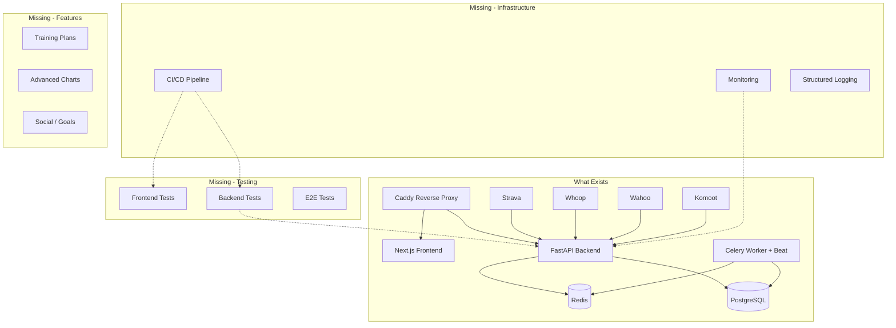

# FitTrack — Project Audit & Improvement Roadmap

> Date: 2026-08-17
> Scope: Full codebase review covering bugs, gaps, improvements, and new feature opportunities

---

## Executive Summary

FitTrack is a well-architected fitness tracker with solid foundations across 18 database tables, 13 API routers, 7 frontend pages, and 4 external integrations. The codebase is ~12k+ lines across ~100 files. The investigation document from today already identified 14 actionable items. This audit extends that with additional findings across **testing**, **security**, **observability**, **developer experience**, **frontend quality**, and **new feature opportunities**.

---

## 1. Known Bugs (from investigation doc)

These are documented in [`plans/investigation-2026-08-17.md`](plans/investigation-2026-08-17.md) but not yet fixed:

| # | Bug | Severity | Status |
|---|-----|----------|--------|
| 1 | Activities page shows only 50 — no "Load More" button | **HIGH** | Unfixed |
| 2 | Calendar recovery badges missing — Whoop cycle upsert overwrites recovery with NULL | **HIGH** | Unfixed |
| 3 | Strain vs Recovery scatter chart plots strain vs strain (not recovery) | **MEDIUM** | Unfixed |
| 4 | SleepLog missing unique constraint — potential duplicate records | **MEDIUM** | Unfixed |

---

## 2. Testing — The Biggest Gap

**Current state: ZERO tests.** [`backend/pyproject.toml`](backend/pyproject.toml:24) lists `pytest` and `pytest-asyncio` as dev dependencies, but no test files exist anywhere in the project.

### What's Missing

- **No backend unit tests** — services like [`merge_service.py`](backend/app/services/merge_service.py), [`cycling.py`](backend/app/services/cycling.py), [`health_analysis.py`](backend/app/services/health_analysis.py), [`lifting.py`](backend/app/services/lifting.py) contain complex scoring/algorithm logic with zero test coverage
- **No API integration tests** — no endpoint testing with [`httpx`](https://github.com/encode/httpx) AsyncClient
- **No frontend tests** — no Jest/Vitest, no React Testing Library, no Cypress/Playwright
- **No test fixtures or factories** — no way to create test data deterministically

### Impact

Every change to scoring algorithms, merge logic, or chart computation risks silent regressions. The scatter chart bug (item 3 above) would have been caught by even a basic test.

### Recommended Approach

| Layer | Tool | Priority | Scope |
|-------|------|----------|-------|
| Backend unit tests | pytest + pytest-asyncio | **Critical** | Services: merge scoring, FTP estimation, health analysis, power curve |
| Backend API tests | pytest + httpx AsyncClient | **High** | Auth flow, CRUD endpoints, pagination, chart endpoints |
| Frontend component tests | Vitest + React Testing Library | **Medium** | Chart rendering, MetricCard, ReadinessIndicator, ExerciseAutocomplete |
| E2E tests | Playwright | **Low** | Login flow, activity sync, lifting session creation |

---

## 3. Security Gaps

| # | Issue | Location | Severity |
|---|-------|----------|----------|
| 1 | **Default `SECRET_KEY`** — JWTs signed with known key if `.env` not set | [`config.py`](backend/app/config.py:13) | **HIGH** |
| 2 | **No Strava webhook signature verification** — accepts any POST | [`webhooks.py`](backend/app/api/webhooks.py:30) | **MEDIUM** |
| 3 | **No rate limiting** on any endpoint | [`main.py`](backend/app/main.py) | **MEDIUM** |
| 4 | **OAuth tokens stored in plain text** | [`user.py`](backend/app/models/user.py) model | **LOW** (personal project) |
| 5 | **CORS allows `*` methods and headers** | [`main.py:67-73`](backend/app/main.py:67) | **LOW** |
| 6 | **No CSRF protection** — relies on CORS + JWT | Frontend auth | **LOW** |
| 7 | **`any` types in auth callbacks** bypass type safety | [`auth.ts:65,73`](frontend/src/lib/auth.ts:65) | **LOW** |

---

## 4. Code Quality & Technical Debt

### Backend

| # | Issue | Location | Effort |
|---|-------|----------|--------|
| 1 | **Celery tasks use `print()` instead of `logging`** | [`scheduler.py`](backend/app/tasks/scheduler.py) | Small |
| 2 | **N+1 queries in Strava backfill** — loops per-activity for linking | [`strava.py:682-705`](backend/app/services/strava.py:682) | Medium |
| 3 | **Power curve computation is O(n·m)** — loads all streams into memory | [`cycling.py:380-450`](backend/app/services/cycling.py:380) | Medium |
| 4 | **No retry logic on external API calls** — transient failures break sync | All integration clients | Medium |
| 5 | **Settings page export bypasses `authFetch`** — uses raw `fetch()` | [`settings/page.tsx:84-86`](frontend/src/app/(app)/settings/page.tsx:84) | Small |
| 6 | **`db_execute` helper** — unnecessary indirection in charts service | [`charts.py`](backend/app/services/charts.py) | Tiny |
| 7 | **Self-heal migration logic in `main.py` lifespan** — fragile, should be in Alembic | [`main.py:16-50`](backend/app/main.py:16) | Medium |
| 8 | **Missing composite indexes** — `(user_id, start_date)` on activities | Database | Small |

### Frontend

| # | Issue | Location | Effort |
|---|-------|----------|--------|
| 1 | **`any` types throughout** — auth callbacks, dashboard analysis results | [`auth.ts`](frontend/src/lib/auth.ts), [`dashboard/page.tsx`](frontend/src/app/(app)/dashboard/page.tsx) | Small |
| 2 | **No error boundaries** — a crash in any component takes down the whole page | [`layout.tsx`](frontend/src/app/(app)/layout.tsx) | Small |
| 3 | **No loading skeletons** — only a generic [`PageLoadingBar`](frontend/src/components/ui/PageLoadingBar.tsx) | Various pages | Medium |
| 4 | **No 404 / empty states** — pages don't handle empty data gracefully | Various pages | Medium |
| 5 | **No responsive design** — sidebar is fixed `w-64`, no mobile layout | [`Sidebar.tsx`](frontend/src/components/Sidebar.tsx) | Medium |
| 6 | **Field name mismatch risk** — TS interfaces sometimes differ from backend schemas | [`types.ts`](frontend/src/lib/api/types.ts) vs backend schemas | Ongoing |
| 7 | **No accessibility (a11y)** — no ARIA labels, no keyboard navigation, no focus management | All components | Medium |

---

## 5. Missing Infrastructure

| # | Missing | Impact | Effort |
|---|---------|--------|--------|
| 1 | **CI/CD pipeline** — no `.github/workflows`, no automated testing on push | Regressions ship undetected | Medium |
| 2 | **Structured logging** — no JSON logging, no log levels, no correlation IDs | Hard to debug production issues | Small |
| 3 | **Health check endpoint** exists but doesn't verify DB/Redis connectivity | [`main.py:76`](backend/app/main.py:76) returns static `{"status": "ok"}` | Small |
| 4 | **No database backup automation** — `fittrack.py backup` exists but isn't scheduled | Data loss risk | Small |
| 5 | **No environment validation at startup** — missing env vars fail silently | Runtime errors instead of clear startup failures | Small |
| 6 | **No API versioning strategy** — currently `/api/v1/` but no deprecation mechanism | Future breaking changes | Low |
| 7 | **No monitoring/alerting** — no Prometheus metrics, no Sentry error tracking | Blind in production | Medium |

---

## 6. Planned But Not Yet Implemented

### Phase 6 Items (documented in [`plans/phase-6.md`](plans/phase-6.md))

| # | Feature | Status | Dependencies |
|---|---------|--------|--------------|
| 1 | **Expanded Health Warnings** — overtraining, injury risk, illness detection | [`health_analysis.py`](backend/app/services/health_analysis.py) exists, needs frontend integration | None |
| 2 | **Enhanced FTP Estimation** — Riegel formula, confidence scoring | Planned | None |
| 3 | **HR Zone Analysis** — HR zones from LTHR, HR zone distribution chart | Migration 012 adds `lactate_threshold_hr`, computation not yet built | None |
| 4 | **Pace Zones for Running** — Jack Daniels model | Planned | None |
| 5 | **Typical Ranges for Metrics** — FTP W/kg, CTL, VI benchmarks | Planned | None |
| 6 | **Chart Insights** — automated analysis text below charts | Planned | None |
| 7 | **Trend Indicators on MetricCards** — up/down/stable arrows | Planned | None |
| 8 | **Merge-Threshold Analysis** — sensitivity analysis, configurable thresholds | [`docs/merge-thresholds.md`](docs/merge-thresholds.md) exists | None |

### Phase 7 Items (documented in [`plans/phase-7.md`](plans/phase-7.md))

| # | Feature | Status |
|---|---------|--------|
| 1 | **Komoot client rework** — Basic Auth fallback, v007 API | Planned |
| 2 | **Surface/terrain breakdown** — per-route surface profile | [`SurfaceBreakdown.tsx`](frontend/src/components/maps/SurfaceBreakdown.tsx) exists |
| 3 | **Ridden vs unridden routes** — badges and filter | Planned |
| 4 | **Coordinate streams** — higher-fidelity route polylines | Planned |

---

## 7. New Feature Opportunities

### 7a. Training Planning & Periodization

| Feature | Description | Value |
|---------|-------------|-------|
| **Training plan templates** | Create weekly/monthly training blocks with target TSS, volume, intensity | Moves from tracking to coaching |
| **Periodization visualization** | Macrocycle/mesocycle view showing planned vs actual load | See training phases at a glance |
| **Auto-suggested rest days** | Based on TSB, recovery, and training history | Prevents overtraining |
| **Race/event planning** | Add target events, auto-calculate taper periods | Goal-oriented training |

### 7b. Enhanced Analytics

| Feature | Description | Value |
|---------|-------------|-------|
| **Power-duration curve overlay** | Compare power curves from different time periods on same chart | Track fitness changes visually |
| **Fitness freshness form (CTL/ATL/TSB) chart** | Dedicated Banister model chart with race-readiness zones | Already computed, needs dedicated visualization |
| **Lifting progress charts per exercise** | Line chart of estimated 1RM over time per exercise | Track strength gains |
| **Body composition tracking** | Weight + body fat % trends, correlation with performance | [`WeightLog`](backend/app/models/weight.py) exists, needs charts |
| **VO2max estimation** | From power/HR data using the ACSM formula | Free fitness metric |
| **Decoupling analysis** | HR vs power decoupling over long rides (aerobic fitness indicator) | Uses existing stream data |

### 7c. Social & Gamification

| Feature | Description | Value |
|---------|-------------|-------|
| **PR celebrations** | Animated notification when a new PR is detected | Motivation |
| **Streak tracking** | Consecutive training days, weekly consistency | Habit formation |
| **Monthly/yearly summaries** | Annual review with stats, highlights, PRs | Reflection & sharing |
| **Goal setting** | Set targets (e.g., "FTP 300W by December"), track progress | Motivation |

### 7d. Data Import/Export

| Feature | Description | Value |
|---------|-------------|-------|
| **Fit file import** | Import `.fit` files directly (not via Strava) | Independence from Strava |
| **GPX import** | Import GPX files for routes/activities | Interoperability |
| **Strava bulk export** | Export all data in Strava-compatible format | Data portability |
| **PDF reports** | Weekly/monthly training reports as PDF | Sharing with coach |

### 7e. Integrations

| Feature | Description | Value |
|---------|-------------|-------|
| **Garmin Connect** | Another major data source | Broader device support |
| **Apple Health / Google Fit** | Mobile health data aggregation | Recovery + steps data |
| **TrainingPeaks** | Sync structured workouts | Coach integration |
| **Zwift** | Indoor cycling data | Virtual ride tracking |

---

## 8. Recommended Priority Roadmap

### Tier 1 — Fix What's Broken (do first)

1. Fix activities "Load More" button
2. Fix calendar recovery badge bug
3. Fix strain vs recovery scatter chart
4. Add SleepLog unique constraint migration
5. Add `SECRET_KEY` validation at startup
6. Add `X-Total-Count` header to list endpoints

### Tier 2 — Foundation (do soon)

7. Add backend tests for core services (merge, cycling, health analysis, lifting)
8. Add CI pipeline (GitHub Actions: lint + test on push)
9. Switch Celery `print()` to `logging`
10. Add API retry logic with exponential backoff
11. Add composite database indexes
12. Add frontend error boundaries
13. Fix TypeScript `any` types

### Tier 3 — Phase 6 Features (planned work)

14. Chart insights (automated analysis text)
15. Trend indicators on MetricCards
16. Enhanced FTP estimation (Riegel formula)
17. HR zone analysis
18. Typical ranges for metrics
19. Merge-threshold analysis & tuning

### Tier 4 — Phase 7 Features (planned work)

20. Komoot client rework (Basic Auth fallback)
21. Surface breakdown on routes
22. Ridden vs unridden route badges

### Tier 5 — New Features (future)

23. Training plan templates
24. Power-duration curve comparison
25. Weight/body composition charts
26. Monthly/yearly summary reports
27. Mobile responsive layout
28. Additional integrations (Garmin, Apple Health)

---

## Architecture Diagram — Current vs Missing

