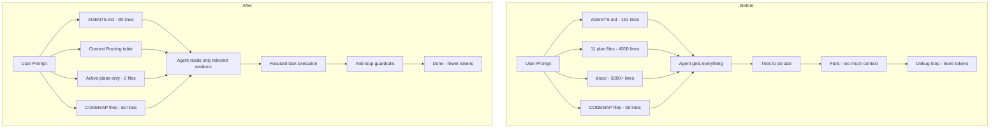

# Plan: Token Optimization & Agent Quality Improvement

> Created: 2026-08-18
> Goal: Reduce token usage, improve answer quality, eliminate debugging loops

---

## Problem Analysis

### Token Consumption Hotspots

| Source | Size | Impact |
|--------|------|--------|
| `AGENTS.md` (injected into every prompt) | ~151 lines, ~5KB | High — sent with every single message |
| `plans/fitness-tracker-architecture.md` | 676 lines, ~20KB | Medium — frequently read by agents |
| Completed phase plans (1,2,3,4,5,5.2) | ~3,500 lines total | Medium — agents reference them |
| Active phase plans (6,7) | ~800 lines total | Low — only read when relevant |
| `docs/merge-thresholds.md` | ~200 lines | Low — niche reference |
| `docs/whoop-api/` (30+ files) | ~5,000+ lines | Low — only relevant for Whoop work |
| CODEMAP files (4 files) | ~60 lines total | Low — lightweight, useful |
| Project file listing (env details) | ~200 entries | High — sent with every message |

### Root Causes of Quality Degradation

1. **Context overload**: AGENTS.md contains implementation-specific details (chart names, trend indicator fields, readiness system internals) that are irrelevant to 80% of tasks. This consumes context window space and dilutes the agent's focus.

2. **No task-scoped context**: Every agent gets the full AGENTS.md regardless of whether they're doing frontend, backend, debugging, or architecture work.

3. **Completed plans still active**: All 11 plan files exist with full detail. Agents may read them thinking they're relevant, wasting tokens on historical implementation notes.

4. **Architecture doc duplication**: `fitness-tracker-architecture.md` (676 lines) largely overlaps with AGENTS.md but is from the project's inception — agents read both, doubling the cost.

5. **No anti-loop guardrails**: No explicit instructions to stop after N failed attempts and ask for help. Agents can burn 50+ tokens in retry loops.

6. **Verbose natural language in AGENTS.md**: The database relationships section uses paragraph form instead of compact notation. The chart system section lists 20+ chart names that could be looked up.

---

## Solution: Five-Part Optimization

### Part 1: Slim AGENTS.md (151 lines → ~90 lines)

**Current**: 151 lines with feature-specific internals, verbose DB descriptions, and niche pitfalls.

**Changes**:

1. **Remove feature-specific internals** — move to CODEMAP files or let agents read source:
   - Chart system paragraph (line 45) — replace with: "Charts: Backend registry `CHART_REGISTRY` in `api/charts.py` → `ChartService` in `services/charts.py`. See source for available charts."
   - Cycling trend indicators paragraph (line 47) — remove entirely, discoverable from `CyclingMetricsSummary` schema
   - Readiness system paragraph (line 49) — remove, discoverable from `api/metrics.py`

2. **Compact database section**:
   - Replace paragraph-form relationships with a compact table
   - Remove JSONB columns list (discoverable from models)
   - Remove unique constraints list (discoverable from migrations)

3. **Trim Critical Pitfalls** (14 → 8):
   - Keep: items 1,2,3,4,5,7,9,10 (truly critical)
   - Remove: 6 (Strava scope — niche), 8 (CORS — standard), 11 (Whoop recovery — implementation detail), 12 (scatter chart — bug-specific), 13 (X-Total-Count — API detail), 14 (SECRET_KEY — startup warning)

4. **Remove Backup/Restore section** — discoverable from `python fittrack.py --help`

5. **Remove Platform Notes** — standard Windows/Docker info, not agent-specific

**Target**: ~90 lines, ~3KB (40% reduction)

### Part 2: Archive Completed Plans

Move completed phase plans to `plans/archive/`:

| File | Status | Action |
|------|--------|--------|
| `plans/phase-1.md` | Complete | → `plans/archive/` |
| `plans/phase-2.md` | Complete | → `plans/archive/` |
| `plans/phase-3.md` | Complete | → `plans/archive/` |
| `plans/phase-4.md` | Complete | → `plans/archive/` |
| `plans/phase-5.md` | Complete | → `plans/archive/` |
| `plans/phase-5.2.md` | Complete | → `plans/archive/` |
| `plans/fitness-tracker-architecture.md` | Superseded by AGENTS.md | → `plans/archive/` |
| `plans/investigation-2026-08-17.md` | Partially addressed | → `plans/archive/` |
| `plans/project-audit-2026-08-17.md` | Reference | → `plans/archive/` |

Keep active in `plans/`:
- `plans/phase-6.md` — in progress
- `plans/phase-7.md` — planned

**Impact**: Agents stop reading 3,500+ lines of historical context. Only active plans remain visible.

### Part 3: Add Anti-Debugging-Loop Instructions to AGENTS.md

Add a new section after "Development Lessons":

```markdown
## Agent Efficiency Rules

1. **Stop after 2 failed attempts**: If the same fix fails twice, stop and describe what you tried, what error you saw, and what you're unsure about. Ask the user for clarification.
2. **Don't read files speculatively**: Only read files you need for the current task. Use CODEMAP files for orientation, not full file reads.
3. **One question, not a loop**: If you're unsure about user intent, ask once. Don't assume and then debug your assumption.
4. **Check AGENTS.md first**: Before reading multiple files, check if AGENTS.md already answers your question.
5. **Prefer small changes**: Make one change, verify it works, then proceed. Don't batch 10 changes and debug.
```

### Part 4: Restructure Context for Task Scoping

Instead of one monolithic AGENTS.md, add a **Context Routing** section at the top that tells agents which sections to read:

```markdown
## Context Routing

| Task Type | Read These Sections |
|-----------|-------------------|
| Backend API/service work | Architecture, Conventions>Backend, Database, Critical Pitfalls |
| Frontend component/page work | Architecture, Conventions>Frontend, Critical Pitfalls |
| Integration/sync work | Architecture, Key Algorithms, Celery Tasks, Critical Pitfalls |
| Database/model work | Database, Conventions>Backend, Critical Pitfalls |
| Debugging | Critical Pitfalls, Development Lessons, Agent Efficiency Rules |
| New feature planning | Overview, Architecture, Planned/Incomplete |
```

This doesn't change the file structure but gives agents a mental model for selective reading.

### Part 5: Consolidate CODEMAP Files

The 4 CODEMAP files are lightweight and useful. Keep them, but add a note to AGENTS.md:

```markdown
### CODEMAP Files
Quick reference maps exist in each package directory:
- `backend/app/api/CODEMAP.md` — API routes and endpoints
- `backend/app/models/CODEMAP.md` — Models and relationships
- `backend/app/schemas/CODEMAP.md` — Pydantic schemas
- `backend/app/services/CODEMAP.md` — Service functions

Use these for orientation before reading full source files.
```

---

## Implementation Checklist

### Part 1: Slim AGENTS.md
- [ ] Remove chart system paragraph, replace with one-liner
- [ ] Remove cycling trend indicators paragraph
- [ ] Remove readiness system paragraph
- [ ] Compact database relationships to table form
- [ ] Remove JSONB columns list
- [ ] Remove unique constraints list
- [ ] Trim Critical Pitfalls from 14 to 8
- [ ] Remove Backup/Restore section
- [ ] Remove Platform Notes section
- [ ] Add Context Routing section at top
- [ ] Add Agent Efficiency Rules section
- [ ] Add CODEMAP Files section
- [ ] Verify file is under 100 lines

### Part 2: Archive Completed Plans
- [ ] Create `plans/archive/` directory
- [ ] Move phase-1.md, phase-2.md, phase-3.md, phase-4.md, phase-5.md, phase-5.2.md
- [ ] Move fitness-tracker-architecture.md
- [ ] Move investigation-2026-08-17.md
- [ ] Move project-audit-2026-08-17.md
- [ ] Verify only phase-6.md and phase-7.md remain in plans/

### Part 3: Update AGENTS.md Planned/Incomplete Section
- [ ] Update references from phase-6 to reflect current status
- [ ] Add phase-7 reference

---

## Expected Impact

| Metric | Before | After | Reduction |
|--------|--------|-------|-----------|
| AGENTS.md lines | 151 | ~90 | 40% |
| Active plan files | 11 | 2 | 82% |
| Total context per task | ~30KB | ~10KB | ~67% |
| Agent focus | Diluted across all docs | Scoped to task type | Quality ↑ |
| Debugging loops | Unbounded | Stop after 2 attempts | Tokens ↓ |

---

## Mermaid: Context Flow Before vs After


