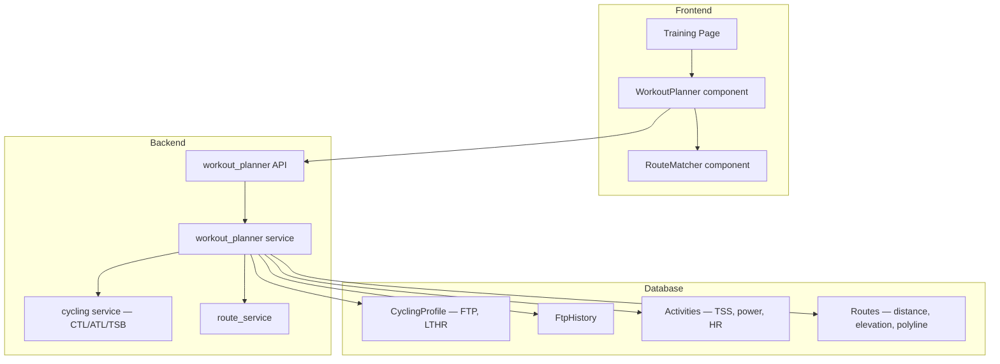

# Workout Planner — Implementation Plan

## Overview

Add a workout planner to the training page that:
1. Derives workout intensity zones from the user's current FTP and LTHR
2. Adjusts zone recommendations based on CTL/TSB (suggests recovery when fatigued)
3. Computes concrete workout targets (power, TSS, HR, IF) for a chosen difficulty + duration
4. Matches historical routes to the planned workout, including unridden routes

## Architecture

## Zone Definitions

Zones are derived from FTP and LTHR. Each zone has:
- IF range (Intensity Factor)
- Power range (watts) = IF × FTP
- HR range = % of LTHR
- TSS per hour = IF² × 100

| Zone | Name | IF Low | IF High | %FTP Low | %FTP High | %LTHR Low | %LTHR High | TSS/hr |
|------|------|--------|---------|----------|-----------|-----------|------------|--------|
| Z1 | Very Easy | 0.00 | 0.55 | 0 | 55 | 0 | 80 | ~15–30 |
| Z2 | Easy | 0.55 | 0.75 | 55 | 75 | 80 | 89 | ~30–55 |
| Z3 | Moderate | 0.75 | 0.90 | 75 | 90 | 89 | 95 | ~55–80 |
| Z4 | Hard | 0.90 | 1.05 | 90 | 105 | 95 | 105 | ~80–105 |
| Z5 | Very Hard | 1.05 | 1.20 | 105 | 120 | 105 | 120 | ~105–130 |

## CTL/TSB-Aware Recommendations

Current TSB = CTL − ATL. Recommendations based on TSB:

| TSB Range | Status | Recommendation |
|-----------|--------|----------------|
| TSB > 25 | Very fresh | All zones available, consider hard sessions |
| TSB 5 to 25 | Fresh | All zones available |
| TSB −10 to 5 | Neutral | Moderate and below recommended |
| TSB −30 to −10 | Fatigued | Easy and below recommended, avoid Z5 |
| TSB < −30 | Very fatigued | Recovery only, rest recommended |

The zones endpoint returns a `recommended_max_zone` and `readiness_note` based on current TSB.

## Route Matching Algorithm

Two scoring paths:

### Ridden Routes
For each route with linked activities:
1. Compute avg TSS, avg power, avg HR, avg duration from last 10 rides
2. Score = weighted proximity to workout targets:
   - TSS match: 35% weight (how close avg TSS is to target TSS)
   - Duration match: 25% weight
   - Power/IF match: 25% weight
   - HR match: 15% weight
3. Bonus: +10% if last ridden within 30 days (familiarity)

### Unridden Routes
For routes with no linked activities:
1. Estimate TSS from distance + elevation + estimated_time_seconds
2. Use flat-terrain IF estimate of 0.70 (moderate) as baseline
3. Adjust for elevation: +5% IF per 1000m elevation per 100km
4. Score = weighted proximity to workout targets (same weights)
5. Lower confidence flag set to true

## New Files

### Backend

#### `backend/app/services/workout_planner.py`
Pure computation service. Key functions:

- `compute_workout_zones(ftp, lthr)` — Returns zone definitions with power/HR/TSS ranges
- `get_readiness_recommendation(ctl, atl, tsb)` — Returns recommended max zone + note
- `plan_workout(ftp, lthr, difficulty, duration_minutes)` — Returns concrete targets
- `estimate_route_tss(distance_m, elevation_m, duration_s, ftp)` — For unridden routes
- `find_matching_routes(db, user_id, targets, max_results)` — Aggregates activity stats per route, scores and ranks

#### `backend/app/schemas/workout_planner.py`
Pydantic schemas:

- `WorkoutZone` — zone id, name, if_range, power_range, hr_range, tss_per_hour_range
- `WorkoutZonesResponse` — zones list, current_ftp, current_lthr, current_ctl, current_atl, current_tsb, recommended_max_zone, readiness_note
- `WorkoutPlanRequest` — difficulty (str), duration_minutes (int)
- `WorkoutPlanResponse` — difficulty, duration_minutes, target_power_low, target_power_high, target_tss_low, target_tss_high, target_if_low, target_if_high, target_hr_low, target_hr_high, estimated_calories
- `RouteMatchRequest` — difficulty (str), duration_minutes (int|None), max_results (int=10)
- `RouteMatchItem` — route_id, route_name, distance_meters, elevation_gain_meters, is_loop, match_score, avg_tss, avg_power, avg_hr, avg_duration_min, ride_count, is_estimated (bool for unridden), confidence
- `RouteMatchResponse` — matches list, workout_target (WorkoutPlanResponse)

#### `backend/app/api/workout_planner.py`
API router with prefix `/api/v1/workout-planner/`:

- `GET /zones` — Returns all zone definitions + readiness recommendation
- `POST /plan` — Returns concrete workout targets for a difficulty + duration
- `POST /match-routes` — Returns ranked route matches

#### Modified: `backend/app/main.py`
Register the new `workout_planner` router.

### Frontend

#### `frontend/src/components/training/WorkoutPlanner.tsx`
Main component:
- Fetches zones on mount
- Shows zone cards with color coding and current readiness
- Difficulty selector (dropdown or zone cards)
- Duration input
- "Plan Workout" button → shows targets
- "Find Routes" button → shows RouteMatcher

#### `frontend/src/components/training/RouteMatcher.tsx`
Route matching display:
- List of matched routes with match score badge
- Shows avg TSS, power, HR, duration, ride count
- Unridden routes shown with lower confidence indicator
- Click route to navigate to route detail

#### `frontend/src/lib/api/workoutPlanner.ts`
API client:
- `getWorkoutZones()` — GET /zones
- `planWorkout(payload)` — POST /plan
- `matchRoutes(payload)` — POST /match-routes

#### Modified: `frontend/src/lib/api/types.ts`
Add TypeScript interfaces matching backend schemas.

#### Modified: `frontend/src/lib/api/index.ts`
Barrel export new functions.

#### Modified: `frontend/src/app/(app)/training/page.tsx`
Add a "Workout Planner" tab alongside existing plan builder and events sections.

## Implementation Order

1. Backend service: `workout_planner.py` — all computation logic
2. Backend schemas: `workout_planner.py` — request/response models
3. Backend API: `workout_planner.py` — 3 endpoints
4. Register router in `main.py`
5. Frontend types in `types.ts`
6. Frontend API client: `workoutPlanner.ts`
7. Frontend WorkoutPlanner component
8. Frontend RouteMatcher component
9. Integrate into training page
10. Update AGENTS.md
